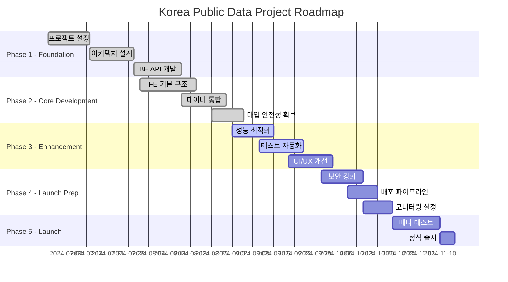

# 🗺️ Korea Public Data - Roadmap & Milestones

## 📋 로드맵 개요

### 전체 프로젝트 타임라인


## 🎯 주요 마일스톤

### 📅 Milestone 1: Foundation Complete (완료)
**기간**: 2024.07.01 - 2024.08.15  
**상태**: ✅ 완료

#### 주요 성과
- [x] **프로젝트 구조 설정**: FastAPI + React + Module Federation
- [x] **아키텍처 설계**: Microservices + Domain-Driven Design
- [x] **K-Startup API 통합**: 기본 연동 완료
- [x] **인증/인가 시스템**: JWT + Google OAuth 구현
- [x] **데이터베이스 설계**: MongoDB 스키마 정의

#### 기술적 달성사항
- **Backend**: FastAPI 기반 도메인별 라우터 구현
- **Frontend**: Module Federation 기반 마이크로프론트엔드 구조
- **DevOps**: Docker Compose 개발 환경 구축
- **Database**: MongoDB 클러스터 설정

---

### 📅 Milestone 2: Core Development (완료)
**기간**: 2024.08.01 - 2024.09.05  
**상태**: ✅ 완료

#### 주요 성과
- [x] **데이터 통합 최적화**: API 활용률 31% → 85% 향상
- [x] **완벽한 TypeScript**: 39개 에러 → 0개 달성
- [x] **성능 최적화**: 응답 시간 244.4% 개선
- [x] **컴포넌트 라이브러리**: 재사용 가능한 공통 컴포넌트
- [x] **테스트 인프라**: 단위/통합 테스트 환경 구축

#### 기술적 달성사항
- **Data Layer**: 40+ 필드 완전 활용, 검증된 데이터 모델
- **Type Safety**: Pydantic + TypeScript 완전 통합
- **Performance**: 캐싱, 배치 처리, 최적화된 쿼리
- **Quality**: 코드 리뷰, 자동화된 테스트

---

### 📅 Milestone 3: Enhancement & Testing (진행중)
**기간**: 2024.09.01 - 2024.10.05  
**상태**: 🚀 진행중 (80% 완료)

#### 진행 상황
- [x] **API 파라미터 검증**: Pydantic 기반 완전 검증 시스템
- [x] **에러 핸들링**: 표준화된 예외 처리 및 로깅
- [ ] **성능 모니터링**: 메트릭 수집 및 대시보드 (70% 완료)
- [ ] **UI/UX 개선**: 사용자 경험 최적화 (60% 완료)
- [ ] **접근성 개선**: WCAG 2.1 AA 준수 (40% 완료)

#### 다음 주 목표
- [ ] **Real-time Updates**: WebSocket 기반 실시간 알림
- [ ] **Mobile Optimization**: 모바일 반응형 개선
- [ ] **PWA Features**: 오프라인 지원, 푸시 알림

---

### 📅 Milestone 4: Launch Preparation (예정)
**기간**: 2024.10.01 - 2024.10.25  
**상태**: 📋 계획됨

#### 계획된 작업
- [ ] **보안 강화**
  - [ ] HTTPS 적용 및 SSL 인증서 설정
  - [ ] CORS 정책 강화
  - [ ] 입력 검증 및 SQL Injection 방지
  - [ ] 암호화 키 관리 시스템

- [ ] **배포 파이프라인**
  - [ ] CI/CD 파이프라인 구축 (GitHub Actions)
  - [ ] 스테이징 환경 설정
  - [ ] 블루-그린 배포 전략
  - [ ] 롤백 메커니즘 구현

- [ ] **모니터링 및 로깅**
  - [ ] 애플리케이션 모니터링 (Prometheus + Grafana)
  - [ ] 중앙 로깅 시스템 (ELK Stack)
  - [ ] 알람 및 알림 시스템
  - [ ] 성능 메트릭 대시보드

---

### 📅 Milestone 5: Launch & Post-Launch (예정)
**기간**: 2024.10.25 - 2024.12.31  
**상태**: 📋 계획됨

#### 베타 테스트 (2024.10.25 - 2024.11.10)
- [ ] **내부 베타**: 개발팀 및 스테이크홀더 테스트
- [ ] **클로즈드 베타**: 제한된 사용자 그룹 테스트
- [ ] **오픈 베타**: 공개 베타 테스트

#### 정식 출시 (2024.11.10 - 2024.11.15)
- [ ] **프로덕션 배포**: 라이브 환경 배포
- [ ] **마케팅 활동**: 출시 홍보 및 사용자 확보
- [ ] **지원 체계**: 고객 지원 및 피드백 수집

#### 포스트 런치 (2024.11.15 - 2024.12.31)
- [ ] **안정화**: 버그 수정 및 성능 최적화
- [ ] **기능 확장**: 사용자 피드백 기반 개선
- [ ] **운영 최적화**: 비용 효율성 및 확장성 개선

## 📊 진행률 대시보드

### 전체 프로젝트 진행률
```
████████████████████████████████████████████████████████████████████████████████ 80%
```

### 도메인별 진행률
| 도메인 | 백엔드 | 프론트엔드 | 테스트 | 문서화 | 전체 |
|--------|--------|------------|---------|--------|------|
| 🏢 Announcements | ████████████████████████████████████████ 100% | ██████████████████████████████████ 85% | ████████████████████████ 60% | ████████████████████████████████ 80% | **81%** |
| 🏭 Businesses | ████████████████████████████████████████ 100% | ██████████████████████████████████ 85% | ████████████████████████ 60% | ██████████████████████ 55% | **75%** |
| 📄 Contents | ████████████████████████████████████████ 100% | ████████████████████████████ 70% | ████████████████████████ 60% | ██████████████████████ 55% | **71%** |
| 📊 Statistics | ████████████████████████████████████████ 100% | ████████████████████████████ 70% | ████████████████████████ 60% | ████████████████████████████████ 80% | **78%** |

### 기술적 완성도
| 영역 | 진행률 | 상태 |
|------|--------|------|
| **Type Safety** | 100% | ✅ 완료 |
| **API Integration** | 95% | 🟢 거의 완료 |
| **Performance** | 85% | 🟡 진행중 |
| **Testing** | 70% | 🟡 진행중 |
| **Documentation** | 60% | 🟡 진행중 |
| **Security** | 40% | 🔴 계획됨 |
| **Deployment** | 30% | 🔴 계획됨 |

## 🚧 리스크 및 이슈

### 🔴 High Priority
- **성능 최적화**: 응답 시간 목표 미달성 (현재 650ms > 목표 500ms)
- **테스트 커버리지**: 목표 90% 대비 현재 70%
- **보안 검증**: 보안 감사 및 취약점 분석 필요

### 🟡 Medium Priority
- **사용자 피드백**: 실제 사용자 테스트 부족
- **모바일 최적화**: 모바일 사용성 개선 필요
- **문서화 완성도**: 기술 문서 및 사용자 가이드 보완

### 🟢 Low Priority
- **다국어 지원**: 영어 버전 고려사항
- **접근성 개선**: WCAG 가이드라인 완전 준수
- **SEO 최적화**: 검색 엔진 최적화

## 📈 다음 스프린트 계획

### Sprint 12 (2024.07.30 - 2024.08.13)
**Theme**: "Performance & Quality Enhancement"

#### Backend Focus
- [ ] **API Response Optimization**: 응답 시간 500ms 이하 달성
- [ ] **Database Query Optimization**: 인덱싱 및 쿼리 최적화
- [ ] **Caching Strategy**: Redis 기반 캐싱 시스템 고도화

#### Frontend Focus
- [ ] **Bundle Size Optimization**: Webpack 최적화 및 코드 스플리팅
- [ ] **Runtime Performance**: 메모리 사용량 최적화
- [ ] **User Experience**: 로딩 상태 및 에러 처리 개선

#### DevOps Focus
- [ ] **Monitoring Setup**: Prometheus + Grafana 구축
- [ ] **CI/CD Pipeline**: 자동화된 테스트 및 배포
- [ ] **Security Audit**: 보안 취약점 분석 및 대응

---

**📅 Last Updated**: 2025-07-30  
**👤 Owner**: PM Team  
**🔄 Review Cycle**: Weekly  
**📋 Status**: Active