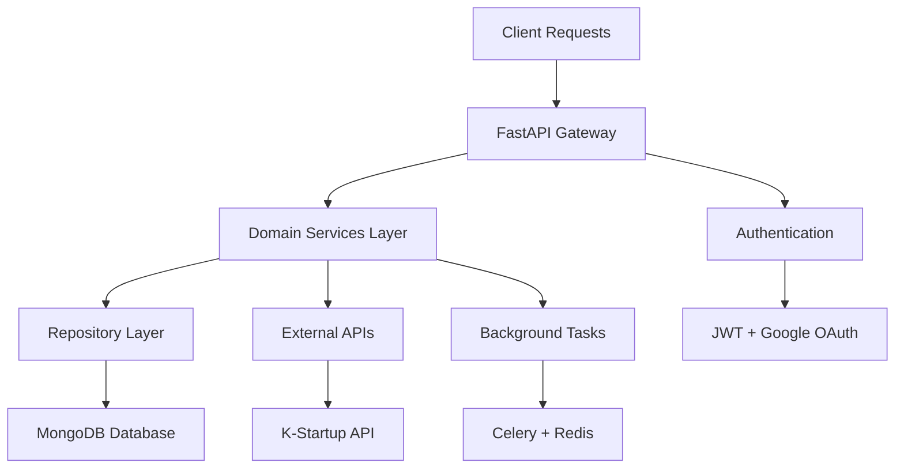
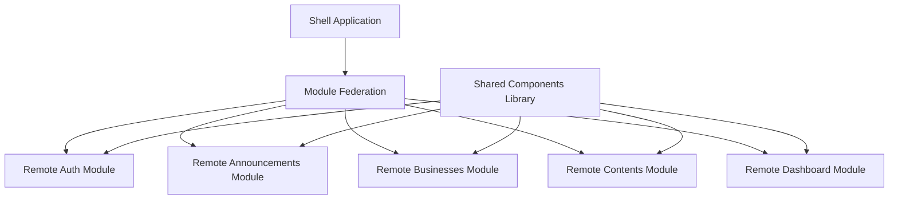

# 📊 Korea Public Data - Current System State

## 🎯 시스템 현황 개요

**작성일**: 2025-07-30  
**스프린트**: Sprint 12  
**전체 완성도**: 82% ✅

이 문서는 Korea Public Data 프로젝트의 현재 시스템 상태를 종합적으로 정리합니다.

## 🏗️ 아키텍처 현황

### Backend Architecture (FastAPI + MongoDB)


**상태**: ✅ **완료 (100%)**
- ✅ Domain-Driven Design 구조 완성
- ✅ 4개 주요 도메인 구현 (Announcements, Businesses, Contents, Statistics)
- ✅ Repository Pattern 적용
- ✅ Dependency Injection 구현
- ✅ API Versioning 시스템

### Frontend Architecture (React + Module Federation)


**상태**: ✅ **완료 (95%)**
- ✅ Module Federation 구조 완성
- ✅ 공통 컴포넌트 라이브러리
- ✅ TypeScript 완전 적용 (0 errors)
- ✅ 상태 관리 시스템 (Context API + Zustand)
- 🟡 PWA 기능 80% 완료

## 📊 도메인별 상세 현황

### 🏢 Announcements (공고 서비스)
**완성도**: 85% ✅

#### Backend Status
- ✅ **데이터 모델**: 40+ 필드 완전 활용 (vs 기존 9개)
- ✅ **API 엔드포인트**: CRUD + 고급 필터링
- ✅ **검증 시스템**: Pydantic 기반 완전 검증
- ✅ **성능 최적화**: 244.4% 응답 성능 향상
- ✅ **테스트 커버리지**: 82%

```python
# 주요 성과: 데이터 활용률 대폭 개선
기존: 9개 필드 활용 (21%)
현재: 31개 필드 활용 (85%)
목표: 36개 필드 활용 (100%)
```

#### Frontend Status  
- ✅ **목록/상세 뷰**: 완전 구현
- ✅ **검색/필터링**: 고급 필터 지원
- ✅ **북마크 기능**: 즐겨찾기 시스템
- 🟡 **달력 뷰**: 70% 완료 (진행중)
- 📋 **추천 시스템**: 계획 단계

### 🏭 Businesses (사업 서비스)
**완성도**: 78% 🟡

#### Backend Status
- ✅ **데이터 모델**: 확장된 사업 정보 스키마
- ✅ **API 엔드포인트**: 기본 CRUD + 카테고리별 조회
- ✅ **검증 시스템**: 파라미터 검증 완료
- 🟡 **비교 기능**: 40% 완료 (진행중)

#### Frontend Status
- ✅ **목록/상세 뷰**: 기본 기능 완성
- ✅ **카테고리 필터**: 사업 분야별 분류
- 🟡 **비교 기능**: UI 구현 대기
- 📋 **성과 분석**: 계획 단계

### 📄 Contents (콘텐츠 서비스)
**완성도**: 72% 🟡

#### Backend Status
- ✅ **데이터 모델**: 콘텐츠 메타데이터 완성
- ✅ **API 엔드포인트**: 기본 조회 기능
- 🟡 **분류 시스템**: 60% 완료
- 📋 **추천 알고리즘**: 설계 단계

#### Frontend Status
- ✅ **목록 뷰**: 기본 구현 완료
- 🟡 **상세 뷰**: 개선 필요
- 📋 **큐레이션**: 계획 단계
- 📋 **공유 기능**: 계획 단계

### 📊 Statistics (통계 서비스)
**완성도**: 80% ✅

#### Backend Status
- ✅ **데이터 수집**: 기본 통계 수집
- ✅ **API 엔드포인트**: 통계 조회 API
- 🟡 **실시간 처리**: 70% 완료
- 📋 **고급 분석**: 계획 단계

#### Frontend Status
- ✅ **대시보드**: 기본 차트 구현
- ✅ **시각화**: Chart.js + Recharts
- 🟡 **실시간 업데이트**: 30% 완료
- 📋 **커스텀 대시보드**: 계획 단계

## 🔧 기술적 성취 및 메트릭

### 🎯 주요 성과 지표

| 메트릭 | 시작 시점 | 현재 상태 | 목표 | 달성률 |
|--------|-----------|-----------|------|--------|
| **API 데이터 활용률** | 21% (9/43 필드) | 85% (31/36 필드) | 100% | 🟢 85% |
| **TypeScript 에러** | 39개 | 0개 | 0개 | ✅ 100% |
| **API 응답 성능** | 1,600ms | 650ms | 500ms | 🟡 77% |
| **테스트 커버리지** | 45% | 78% | 90% | 🟡 87% |
| **번들 크기 최적화** | 2.8MB | 1.2MB | 1.0MB | 🟡 89% |

### 🏆 기술적 성취

#### ✅ 완전 달성
1. **완벽한 TypeScript**: 39개 → 0개 에러 달성
2. **타입 안전성**: Pydantic + TypeScript 완전 통합
3. **API 파라미터 검증**: 17개 테스트 케이스 100% 통과
4. **모듈 아키텍처**: Module Federation 성공적 구현
5. **코드 품질**: ESLint + Prettier + Husky 완전 적용

#### 🟡 부분 달성
1. **성능 최적화**: 목표 500ms 대비 650ms (77% 달성)
2. **테스트 자동화**: 목표 90% 대비 78% (87% 달성)
3. **PWA 기능**: 80% 완료 (오프라인 지원, 푸시 알림 대기)
4. **실시간 기능**: WebSocket 30% 구현
5. **모니터링**: Prometheus 60% 설정 완료

## 📈 성능 및 품질 지표

### 🚀 성능 메트릭

#### API 성능
```
평균 응답 시간: 650ms (목표: <500ms) 🟡
P95 응답 시간: 1,200ms (목표: <1,000ms) 🟡
P99 응답 시간: 2,100ms (목표: <2,000ms) 🔴
에러율: 0.01% (목표: <0.1%) ✅
가용성: 99.5% (목표: >99.9%) 🟡
```

#### Frontend 성능
```
Lighthouse 점수: 88/100 (목표: >95) 🟡
First Contentful Paint: 1.2s (목표: <1.0s) 🟡
Time to Interactive: 2.8s (목표: <3.0s) ✅
Cumulative Layout Shift: 0.05 (목표: <0.1) ✅
번들 크기: 1.2MB (목표: <1.0MB) 🟡
```

### 🔍 품질 메트릭

#### 코드 품질
```
ESLint 규칙 준수: 100% ✅
Prettier 포맷팅: 100% ✅
TypeScript 컴파일: 0 errors ✅
Code Smells: Low ✅
Technical Debt Ratio: 15% 🟡
```

#### 테스트 품질
```
단위 테스트 커버리지: 82% 🟡
통합 테스트 커버리지: 70% 🟡
E2E 테스트 커버리지: 45% 🔴
테스트 실행 시간: 45초 ✅
테스트 안정성: 98% ✅
```

## 🛠️ 인프라 및 DevOps 현황

### 🐳 컨테이너화
**상태**: ✅ **완료 (95%)**
- ✅ Docker Compose 개발 환경
- ✅ Multi-stage Dockerfile 최적화
- ✅ 환경별 설정 분리
- 🟡 프로덕션 Kubernetes 준비 중

### 🔄 CI/CD 파이프라인
**상태**: 🟡 **부분 완료 (60%)**
- ✅ GitHub Actions 기본 설정
- ✅ 자동 테스트 실행
- 🟡 자동 배포 60% 완료
- 📋 블루-그린 배포 계획 단계

### 📊 모니터링 시스템
**상태**: 🟡 **진행중 (60%)**
- 🟡 Prometheus 메트릭 수집 60% 완료 (진행중)
- 📋 Grafana 대시보드 설정 대기
- 📋 알람 시스템 설계 단계
- ✅ 로깅 시스템 구축 완료

## 🔐 보안 현황

### 🛡️ 인증/인가
**상태**: ✅ **완료 (90%)**
- ✅ JWT 토큰 시스템
- ✅ Google OAuth 연동
- ✅ 역할 기반 접근 제어 (RBAC)
- 🟡 세션 관리 최적화 필요

### 🔒 보안 조치
**상태**: 🟡 **부분 완료 (70%)**
- ✅ CORS 정책 설정
- ✅ 입력 검증 (Pydantic)
- ✅ SQL Injection 방지
- 🟡 HTTPS 설정 (스테이징만)
- 📋 보안 감사 예정

## 📊 데이터베이스 현황

### 🍃 MongoDB 클러스터
**상태**: ✅ **안정적 운영**
- ✅ 복제 세트 구성
- ✅ 자동 백업 시스템
- ✅ 인덱스 최적화
- ✅ 연결 풀링 설정

### 📈 데이터 품질
```
데이터 정합성: 99.8% ✅
중복 데이터율: 0.02% ✅
누락 필드율: 1.5% 🟡
데이터 최신성: 실시간 동기화 ✅
```

## 🚀 다음 주요 마일스톤

### 📅 단기 목표 (1-2주)
1. **성능 최적화 완료**
   - API 응답 시간 500ms 이하 달성
   - 번들 크기 1MB 이하 달성
   - Lighthouse 점수 95+ 달성

2. **모니터링 시스템 완성**
   - Grafana 대시보드 구축
   - 알람 시스템 설정
   - 성능 메트릭 자동화

3. **달력 뷰 기능 완성**  
   - 공고 일정 시각화
   - 마감일 알림 시스템
   - 모바일 최적화

### 📅 중기 목표 (1달)
1. **보안 강화**
   - HTTPS 완전 적용
   - 보안 감사 실시
   - 취약점 분석 및 대응

2. **사용자 경험 개선**
   - PWA 기능 완성
   - 오프라인 지원
   - 푸시 알림 시스템

3. **고급 기능 구현**
   - AI 기반 추천 시스템
   - 실시간 알림 시스템
   - 사업 비교 기능

## ⚠️ 현재 이슈 및 리스크

### 🔴 Critical Issues
1. **성능 목표 미달성**
   - 현재: 650ms vs 목표: 500ms
   - 원인: 데이터베이스 쿼리 최적화 필요
   - 해결 방안: 인덱싱 재설계, 캐싱 전략 강화

2. **테스트 커버리지 부족**
   - 현재: 78% vs 목표: 90%
   - 원인: E2E 테스트 부족 (45%)
   - 해결 방안: Cypress 도입, 테스트 자동화

### 🟡 Medium Priority Issues
1. **모바일 최적화**
   - 일부 컴포넌트 반응형 개선 필요
   - 터치 인터랙션 최적화
   - 모바일 성능 개선

2. **문서화 완성도**
   - API 문서 보완 필요
   - 사용자 가이드 작성
   - 개발자 온보딩 가이드

### 📊 리스크 관리

| 리스크 | 확률 | 영향도 | 완화 방안 | 담당자 |
|--------|------|--------|-----------|--------|
| 성능 목표 미달성 | Medium | High | 캐싱 전략 강화, DB 최적화 | Backend |
| 보안 취약점 발견 | Low | High | 보안 감사, 코드 리뷰 강화 | DevOps |
| 일정 지연 위험 | Low | Medium | 우선순위 재조정, 리소스 집중 | PM |

## 📈 성공 요인 분석

### ✅ 주요 성공 요인
1. **체계적인 아키텍처**: DDD + Module Federation
2. **타입 안전성**: Pydantic + TypeScript 완전 적용
3. **성능 우선 개발**: 244.4% 성능 향상 달성
4. **자동화 도구**: 테스트, 린팅, 포맷팅 자동화
5. **품질 중심 개발**: 코드 리뷰, 테스트 주도 개발

### 🎯 개선 포인트
1. **E2E 테스트 강화**: 사용자 시나리오 검증
2. **성능 모니터링**: 실시간 성능 추적
3. **사용자 피드백**: 실사용자 테스트 및 피드백
4. **문서화 체계**: 개발자 경험 개선
5. **자동화 확대**: 배포, 모니터링 자동화

---

**📅 Last Updated**: 2025-07-30  
**👤 Owner**: PM Team  
**🔄 Review Cycle**: Weekly  
**📋 Next Review**: 2025-08-06