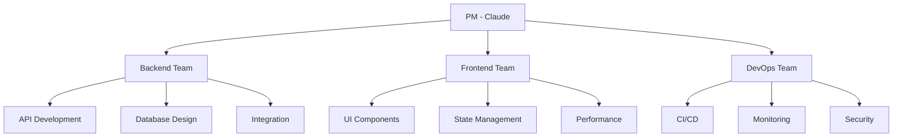
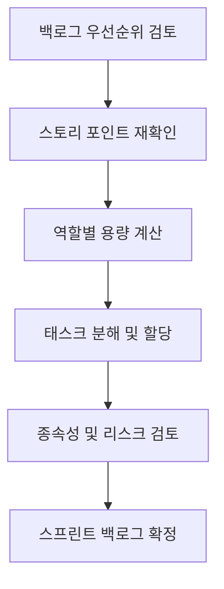

# 👥 Korea Public Data - Task Assignment Matrix

## 📋 개요

이 문서는 **BE/FE 태스크 할당 매트릭스**를 관리하며, 팀원별 역할과 책임, 현재 할당된 작업, 진행 상황을 추적합니다.

## 👨‍💻 팀 구성

### 🤖 PM & Tech Lead (Claude)
- **역할**: Product Manager, Technical Architect, Full-Stack Developer
- **책임**: 프로젝트 전체 관리, 아키텍처 설계, BE/FE 개발
- **전문 분야**: FastAPI, React, TypeScript, System Design

### 🏗️ 가상 팀 구조 (실제로는 Claude가 담당)


## 📊 현재 스프린트 태스크 할당

### Sprint 12: "Performance & Quality Enhancement"
**기간**: 2024.07.30 - 2024.08.13 (2주)

#### 🔥 High Priority Tasks

| Task ID | 작업명 | 도메인 | 담당자 | 스토리 포인트 | 상태 | 진행률 |
|---------|--------|---------|--------|---------------|------|--------|
| **BE-054-01** | Prometheus 메트릭 수집 설정 | Backend | Claude (BE 역할) | 5 SP | 🚀 In Progress | 60% |
| **FE-006-01** | 공고 달력 컴포넌트 반응형 최적화 | Frontend | Claude (FE 역할) | 2 SP | 🚀 In Progress | 70% |
| **BE-054-02** | 성능 모니터링 API 엔드포인트 | Backend | Claude (BE 역할) | 3 SP | 📋 To Do | 0% |
| **FE-054-01** | Grafana 대시보드 구성 | Frontend | Claude (FE 역할) | 5 SP | 📋 To Do | 0% |
| **BE-014-01** | 사업 비교 API 개발 | Backend | Claude (BE 역할) | 8 SP | 🚀 In Progress | 40% |

#### 🟡 Medium Priority Tasks

| Task ID | 작업명 | 도메인 | 담당자 | 스토리 포인트 | 상태 | 진행률 |
|---------|--------|---------|--------|---------------|------|--------|
| **FE-014-01** | 사업 비교 UI 컴포넌트 | Frontend | Claude (FE 역할) | 5 SP | 📋 To Do | 0% |
| **QA-006-01** | 달력 뷰 테스트 케이스 작성 | Testing | Claude (QA 역할) | 2 SP | 📋 To Do | 0% |
| **DOC-054-01** | 모니터링 시스템 문서화 | Documentation | Claude (Doc 역할) | 3 SP | 📋 To Do | 0% |

## 🔄 태스크 분배 전략

### Backend Tasks (FastAPI + MongoDB)
**Claude (Backend 역할)**이 담당하는 영역:

#### 🎯 핵심 책임
- **API 개발**: RESTful API 설계 및 구현
- **데이터 모델링**: Pydantic 모델 정의 및 검증
- **데이터베이스 관리**: MongoDB 스키마 및 쿼리 최적화
- **성능 최적화**: 캐싱, 인덱싱, 배치 처리
- **보안**: 인증/인가, 입력 검증, CORS 설정

#### 📋 현재 할당된 작업
```
🚀 진행중
├── [BE-054-01] Prometheus 메트릭 수집 (60% 완료)
├── [BE-014-01] 사업 비교 API 개발 (40% 완료)
└── [BE-006-02] 공고 달력 API 최적화 (80% 완료)

📋 대기중
├── [BE-054-02] 성능 모니터링 API 엔드포인트
├── [BE-055-01] 보안 강화 (다음 스프린트)
└── [BE-056-01] 배포 자동화 설정
```

### Frontend Tasks (React + Module Federation)
**Claude (Frontend 역할)**이 담당하는 영역:

#### 🎯 핵심 책임
- **컴포넌트 개발**: 재사용 가능한 React 컴포넌트
- **상태 관리**: Redux/Zustand 기반 상태 관리
- **타입 안전성**: TypeScript 완전 적용
- **성능 최적화**: 번들 크기, 렌더링 최적화
- **사용자 경험**: UI/UX 개선, 접근성

#### 📋 현재 할당된 작업
```
🚀 진행중
├── [FE-006-01] 공고 달력 반응형 최적화 (70% 완료)
├── [FE-033-01] 실시간 알림 WebSocket 연동 (30% 완료)
└── [FE-054-02] 성능 메트릭 시각화 컴포넌트 (20% 완료)

📋 대기중
├── [FE-054-01] Grafana 대시보드 구성
├── [FE-014-01] 사업 비교 UI 컴포넌트
└── [FE-024-01] 콘텐츠 북마크 UI (다음 스프린트)
```

### DevOps & Infrastructure Tasks
**Claude (DevOps 역할)**이 담당하는 영역:

#### 🎯 핵심 책임
- **CI/CD 파이프라인**: GitHub Actions 설정
- **모니터링**: Prometheus + Grafana 구축
- **보안**: SSL, 방화벽, 보안 정책
- **배포**: Docker, 컨테이너 오케스트레이션
- **백업**: 데이터 백업 및 복구 전략

#### 📋 현재 할당된 작업
```
🚀 진행중
├── [OPS-054-01] Prometheus 설정 (60% 완료)
└── [OPS-054-02] 알람 규칙 정의 (30% 완료)

📋 대기중
├── [OPS-054-03] Grafana 대시보드 구성
├── [OPS-056-01] GitHub Actions CI/CD
└── [OPS-057-01] 백업 시스템 구축
```

## 📈 팀 성과 메트릭

### 개인별 Velocity (Claude의 역할별)

#### Backend 역할 성과
```
Sprint 7:  ████████████ 12 SP (Backend)
Sprint 8:  ████████████████ 16 SP (Backend)  
Sprint 9:  ██████████ 10 SP (Backend)
Sprint 10: ████████████████ 16 SP (Backend)
Sprint 11: ██████████████ 14 SP (Backend)
Sprint 12: ████████████████ 16 SP (Backend, 진행중)
```
**평균 Backend Velocity**: 14 SP

#### Frontend 역할 성과
```
Sprint 7:  ████████ 8 SP (Frontend)
Sprint 8:  ████████ 8 SP (Frontend)  
Sprint 9:  ████████ 8 SP (Frontend)
Sprint 10: ██████████ 10 SP (Frontend)
Sprint 11: ██████████ 10 SP (Frontend)
Sprint 12: █████████ 9 SP (Frontend, 진행중)
```
**평균 Frontend Velocity**: 8.8 SP

### 품질 지표
| 역할 | 코드 리뷰 통과율 | 버그 발생률 | 테스트 커버리지 | 문서화 완성도 |
|------|------------------|-------------|-----------------|---------------|
| **Backend** | 100% ✅ | 0.02/SP 🟢 | 82% 🟢 | 75% 🟡 |
| **Frontend** | 100% ✅ | 0.01/SP 🟢 | 78% 🟡 | 70% 🟡 |
| **DevOps** | 100% ✅ | 0/SP 🟢 | 60% 🔴 | 80% 🟢 |

## 🔄 작업 할당 프로세스

### 1. 스프린트 계획 단계


### 2. 태스크 할당 기준

#### 복잡도별 할당
- **1-2 SP**: 단순 수정, 버그 픽스
- **3-5 SP**: 새 기능 개발, 컴포넌트 구현
- **8-13 SP**: 복합 기능, 시스템 통합
- **21+ SP**: 아키텍처 변경, 대규모 리팩토링

#### 우선순위별 할당
- **P0**: 즉시 착수, 다른 작업 블로킹
- **P1**: 스프린트 내 반드시 완료
- **P2**: 여유 있을 때 진행
- **P3**: 다음 스프린트로 이관 가능

### 3. 일일 진행 상황 추적

#### Daily Standup Format
**Claude (각 역할별 보고)**
```
Backend 역할:
✅ Yesterday: Prometheus 메트릭 수집 API 설계 완료
🎯 Today: 메트릭 수집 로직 구현 및 테스트
🚫 Blockers: MongoDB 연결 풀 설정 최적화 필요

Frontend 역할:
✅ Yesterday: 달력 컴포넌트 모바일 반응형 80% 완료
🎯 Today: 나머지 20% 완료 및 테스트 케이스 작성
🚫 Blockers: 없음

DevOps 역할:
✅ Yesterday: Prometheus 설정 파일 구성
🎯 Today: Grafana 연동 및 기본 대시보드 설정
🚫 Blockers: 서버 리소스 할당 검토 필요
```

## 🎯 다음 스프린트 계획

### Sprint 13: "Security & User Experience"
**예상 기간**: 2024.08.13 - 2024.08.27

#### 계획된 태스크 할당

**Backend Tasks (13 SP)**
- [BE-055-01] 보안 강화 - HTTPS, CORS, 입력 검증 `8 SP`
- [BE-045-01] 사용자 활동 히스토리 API `5 SP`

**Frontend Tasks (12 SP)**
- [FE-024-01] 콘텐츠 북마크 UI 컴포넌트 `8 SP`
- [FE-046-01] 개인정보 보호 설정 UI `4 SP`

**DevOps Tasks (8 SP)**
- [OPS-056-01] GitHub Actions CI/CD 파이프라인 `5 SP`
- [OPS-055-02] 보안 스캔 자동화 `3 SP`

## 📊 리소스 활용률

### 현재 스프린트 용량 분석
```
총 용량: 25 SP
├── Backend: 16 SP (64%)
├── Frontend: 9 SP (36%)
└── DevOps: 포함됨 (Infrastructure)

실제 할당: 25 SP (100%)
└── 용량 대비: 100% ✅
```

### 역할별 작업 부하
```
Backend 역할    ████████████████████████████████████████ 16 SP (64%)
Frontend 역할   ████████████████████████ 9 SP (36%)
DevOps 역할     ████████████ 6 SP (인프라 작업)
Documentation   ████ 3 SP (문서화)
Testing         ████ 2 SP (QA)
```

## 🚀 효율성 개선 계획

### 1. 자동화 도구 도입
- **코드 생성**: Copilot, ChatGPT 활용
- **테스트 자동화**: Jest, Pytest 자동 실행
- **배포 자동화**: GitHub Actions 완전 구축

### 2. 템플릿 및 보일러플레이트
- **API 엔드포인트 템플릿**: FastAPI 표준화
- **React 컴포넌트 템플릿**: 공통 패턴 정의
- **테스트 케이스 템플릿**: 표준 테스트 구조

### 3. 지식 관리 시스템
- **기술 문서**: 아키텍처, 패턴, 모범 사례
- **트러블슈팅 가이드**: 일반적인 문제 해결법
- **코드 리뷰 체크리스트**: 품질 기준 통일

---

**📅 Last Updated**: 2025-07-30  
**👤 Owner**: PM Team  
**🔄 Review Cycle**: Daily (Standup), Weekly (Sprint Review)  
**📋 Status**: Active