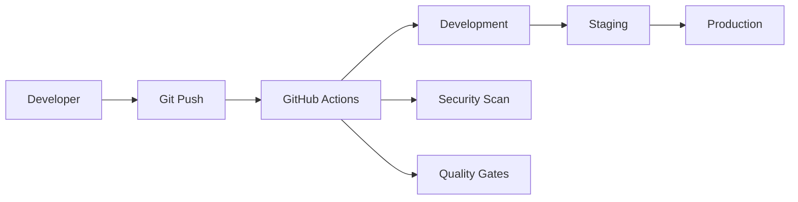

# 🚀 배포 파이프라인

> Korea Public Data 프로젝트의 CI/CD 배포 자동화 전략

## 📋 목차
- [개요](#개요)
- [배포 환경](#배포-환경)
- [CI/CD 파이프라인](#ci-cd-파이프라인)
- [배포 전략](#배포-전략)
- [롤백 전략](#롤백-전략)
- [모니터링 및 알림](#모니터링-및-알림)
- [보안 고려사항](#보안-고려사항)

## 📖 개요

Korea Public Data 프로젝트는 **GitOps 기반 CI/CD**를 통해 안전하고 효율적인 자동 배포를 구현합니다.

### 핵심 원칙
- **Zero Downtime Deployment**: 무중단 배포
- **Automated Testing**: 자동화된 테스트 게이트
- **Rollback Ready**: 즉시 롤백 가능
- **Security First**: 보안 우선 배포

## 🌍 배포 환경

### 환경 구성


| 환경 | 용도 | 배포 트리거 | 접근 권한 |
|------|------|-------------|-----------|
| **Development** | 개발/테스트 | Push to `develop` | 개발팀 |
| **Staging** | UAT/성능테스트 | Push to `staging` | QA팀 |
| **Production** | 운영 서비스 | Manual Approval | 운영팀 |

### 인프라 구성
```yaml
# docker-compose.prod.yml
services:
  # Frontend (Next.js)
  frontend:
    image: korea-public-data/frontend:${VERSION}
    ports:
      - "3000:3000"
    environment:
      - NODE_ENV=production
      - NEXT_PUBLIC_API_URL=${API_URL}

  # Backend (FastAPI)  
  backend:
    image: korea-public-data/backend:${VERSION}
    ports:
      - "8000:8000"
    environment:
      - DATABASE_URL=${DATABASE_URL}
      - REDIS_URL=${REDIS_URL}

  # Database
  mongodb:
    image: mongo:6.0
    volumes:
      - mongo_data:/data/db

  # Cache
  redis:
    image: redis:7-alpine
    volumes:
      - redis_data:/data
```

## 🔄 CI/CD 파이프라인

### Frontend 파이프라인
```yaml
# .github/workflows/frontend-deploy.yml
name: 🎨 Frontend Deployment

on:
  push:
    branches: [main, develop, staging]
    paths: ['fe/**']

jobs:
  test:
    runs-on: ubuntu-latest
    steps:
      - name: Checkout
        uses: actions/checkout@v4
      
      - name: Setup Node.js
        uses: actions/setup-node@v4
        with:
          node-version: '20'
          cache: 'npm'
          cache-dependency-path: fe/package-lock.json
      
      - name: Install Dependencies
        run: cd fe && npm ci
      
      - name: Run Tests
        run: cd fe && npm run test:ci
      
      - name: Run E2E Tests
        run: cd fe && npm run test:e2e
      
      - name: Build Application
        run: cd fe && npm run build
      
      - name: Security Scan
        run: cd fe && npm audit --audit-level high

  build:
    needs: test
    runs-on: ubuntu-latest
    steps:
      - name: Build Docker Image
        run: |
          docker build -t korea-fe:${{ github.sha }} ./fe
          docker tag korea-fe:${{ github.sha }} korea-fe:latest
      
      - name: Push to Registry
        run: |
          docker push korea-fe:${{ github.sha }}
          docker push korea-fe:latest

  deploy-dev:
    if: github.ref == 'refs/heads/develop'
    needs: build
    runs-on: ubuntu-latest
    environment: development
    steps:
      - name: Deploy to Development
        run: |
          kubectl set image deployment/frontend \
            frontend=korea-fe:${{ github.sha }}
  
  deploy-staging:
    if: github.ref == 'refs/heads/staging'
    needs: build
    runs-on: ubuntu-latest
    environment: staging
    steps:
      - name: Deploy to Staging
        run: |
          kubectl set image deployment/frontend \
            frontend=korea-fe:${{ github.sha }}
  
  deploy-prod:
    if: github.ref == 'refs/heads/main'
    needs: build
    runs-on: ubuntu-latest
    environment: production
    steps:
      - name: Deploy to Production
        run: |
          kubectl set image deployment/frontend \
            frontend=korea-fe:${{ github.sha }}
```

### Backend 파이프라인
```yaml
# .github/workflows/backend-deploy.yml
name: ⚙️ Backend Deployment

on:
  push:
    branches: [main, develop, staging]
    paths: ['be/**']

jobs:
  test:
    runs-on: ubuntu-latest
    services:
      mongodb:
        image: mongo:6.0
        ports:
          - 27017:27017
      redis:
        image: redis:7-alpine
        ports:
          - 6379:6379
    
    steps:
      - name: Checkout
        uses: actions/checkout@v4
      
      - name: Setup Python
        uses: actions/setup-python@v4
        with:
          python-version: '3.9'
          cache: 'pip'
      
      - name: Install Dependencies
        run: |
          cd be
          pip install -r requirements.txt
          pip install -r requirements-dev.txt
      
      - name: Run Tests
        run: |
          cd be
          pytest --cov=app --cov-report=xml
      
      - name: Security Scan
        run: |
          cd be
          bandit -r app/
          safety check

  build:
    needs: test
    runs-on: ubuntu-latest
    steps:
      - name: Build Docker Image
        run: |
          docker build -t korea-be:${{ github.sha }} ./be
          docker tag korea-be:${{ github.sha }} korea-be:latest
      
      - name: Run Security Scan
        run: |
          docker run --rm -v /var/run/docker.sock:/var/run/docker.sock \
            aquasec/trivy image korea-be:${{ github.sha }}

  deploy-dev:
    if: github.ref == 'refs/heads/develop'
    needs: build
    runs-on: ubuntu-latest
    environment: development
    steps:
      - name: Deploy to Development
        run: |
          kubectl set image deployment/backend \
            backend=korea-be:${{ github.sha }}
```

## 🎯 배포 전략

### Blue-Green 배포
```yaml
# Blue-Green Deployment Strategy
apiVersion: argoproj.io/v1alpha1
kind: Rollout
metadata:
  name: korea-frontend
spec:
  replicas: 3
  strategy:
    blueGreen:
      activeService: korea-frontend-active
      previewService: korea-frontend-preview
      autoPromotionEnabled: false
      scaleDownDelaySeconds: 30
      prePromotionAnalysis:
        templates:
          - templateName: success-rate
        args:
          - name: service-name
            value: korea-frontend-preview
      postPromotionAnalysis:
        templates:
          - templateName: success-rate
        args:
          - name: service-name
            value: korea-frontend-active
```

### Canary 배포
```yaml
# Canary Deployment for Backend
apiVersion: argoproj.io/v1alpha1
kind: Rollout
metadata:
  name: korea-backend
spec:
  replicas: 5
  strategy:
    canary:
      maxSurge: "25%"
      maxUnavailable: 0
      steps:
        - setWeight: 20
        - pause: {duration: 10m}
        - setWeight: 40
        - pause: {duration: 10m}
        - setWeight: 60
        - pause: {duration: 10m}
        - setWeight: 80
        - pause: {duration: 10m}
```

## 🔄 롤백 전략

### 자동 롤백 트리거
```yaml
# Auto Rollback Conditions
autoRollback:
  enabled: true
  conditions:
    - type: "ErrorRate"
      threshold: "5%"
      duration: "5m"
    - type: "ResponseTime"
      threshold: "2s"
      duration: "3m"
    - type: "HealthCheck"
      failures: 3
```

### 수동 롤백 절차
```bash
#!/bin/bash
# manual-rollback.sh

echo "🔄 Starting rollback process..."

# 1. Get previous version
PREVIOUS_VERSION=$(kubectl rollout history deployment/korea-backend | tail -n 2 | head -n 1 | awk '{print $1}')

# 2. Rollback to previous version
kubectl rollout undo deployment/korea-backend --to-revision=$PREVIOUS_VERSION

# 3. Wait for rollback completion
kubectl rollout status deployment/korea-backend --timeout=300s

# 4. Verify health
curl -f http://api.korea-public-data.com/health || exit 1

echo "✅ Rollback completed successfully"

# 5. Notify team
curl -X POST $SLACK_WEBHOOK_URL \
  -H 'Content-type: application/json' \
  --data '{"text":"🔄 Production rollback completed"}'
```

## 📊 모니터링 및 알림

### 배포 성공률 추적
```yaml
# Deployment Success Rate SLO
apiVersion: monitoring.coreos.com/v1
kind: PrometheusRule
metadata:
  name: deployment-slo
spec:
  groups:
    - name: deployment.rules
      rules:
        - alert: DeploymentFailed
          expr: |
            (
              sum(rate(deployment_status_total{status="failed"}[5m])) by (environment) /
              sum(rate(deployment_status_total[5m])) by (environment)
            ) > 0.1
          for: 5m
          labels:
            severity: critical
          annotations:
            summary: "High deployment failure rate in {{ $labels.environment }}"
```

### 알림 설정
```yaml
# Slack Notifications
notifications:
  deployment_started:
    channel: "#deployments"
    message: "🚀 Deployment started: {{ .Environment }} - {{ .Version }}"
  
  deployment_success:
    channel: "#deployments" 
    message: "✅ Deployment successful: {{ .Environment }} - {{ .Version }}"
  
  deployment_failed:
    channel: "#alerts"
    message: "❌ Deployment failed: {{ .Environment }} - {{ .Version }}"
  
  rollback_triggered:
    channel: "#alerts"
    message: "🔄 Auto-rollback triggered: {{ .Environment }} - {{ .Reason }}"
```

## 🔒 보안 고려사항

### 시크릿 관리
```yaml
# Kubernetes Secrets
apiVersion: v1
kind: Secret
metadata:
  name: korea-app-secrets
type: Opaque
data:
  database-url: <base64-encoded>
  api-key: <base64-encoded>
  jwt-secret: <base64-encoded>

---
# External Secrets Operator
apiVersion: external-secrets.io/v1beta1
kind: SecretStore
metadata:
  name: vault-backend
spec:
  provider:
    vault:
      server: "https://vault.company.com"
      path: "secret"
      version: "v2"
```

### 이미지 보안 스캔
```yaml
# Container Image Security Scan
security_scan:
  tools:
    - name: "Trivy"
      severity: ["HIGH", "CRITICAL"]
      fail_on_vulnerabilities: true
    
    - name: "Snyk"
      monitor: true
      fail_on_issues: true
  
  policy:
    allow_unknown_vulnerabilities: false
    max_acceptable_risk: "medium"
```

## 📈 배포 메트릭

### KPI 추적
| 메트릭 | 목표 | 현재 | 상태 |
|-------|------|------|------|
| 배포 성공률 | >95% | - | 🟡 |
| 평균 배포 시간 | <10분 | - | 🟡 |
| 롤백 시간 | <3분 | - | 🟡 |
| 다운타임 | 0분 | - | 🟡 |

### 배포 통계
```grafana
# Grafana Dashboard Queries
deployment_frequency:
  query: "sum(increase(deployments_total[1d])) by (environment)"
  
deployment_success_rate:
  query: |
    sum(rate(deployments_total{status="success"}[7d])) by (environment) /
    sum(rate(deployments_total[7d])) by (environment) * 100

mean_time_to_recovery:
  query: "avg(rollback_duration_seconds) by (environment)"
```

## 🛠 배포 도구

### 필수 도구
- **CI/CD**: GitHub Actions
- **Container**: Docker, Kubernetes
- **GitOps**: ArgoCD
- **Monitoring**: Prometheus, Grafana
- **Security**: Trivy, Snyk
- **Secrets**: External Secrets Operator

### 배포 스크립트
```bash
#!/bin/bash
# deploy.sh - 원클릭 배포 스크립트

set -e

ENVIRONMENT=${1:-development}
VERSION=${2:-latest}

echo "🚀 Deploying to $ENVIRONMENT (version: $VERSION)"

# Pre-deployment checks
echo "🔍 Running pre-deployment checks..."
./scripts/health-check.sh $ENVIRONMENT

# Deploy
echo "📦 Deploying application..."
kubectl set image deployment/korea-app \
  app=korea-app:$VERSION \
  -n $ENVIRONMENT

# Wait for rollout
echo "⏳ Waiting for deployment..."
kubectl rollout status deployment/korea-app -n $ENVIRONMENT

# Post-deployment verification
echo "✅ Running post-deployment tests..."
./scripts/smoke-test.sh $ENVIRONMENT

echo "🎉 Deployment completed successfully!"
```

## 🔄 업데이트 이력

| 버전 | 날짜 | 변경사항 | 작성자 |
|------|------|----------|--------|
| 1.0.0 | 2025-08-14 | 초기 배포 파이프라인 구축 | PM |

---

*본 배포 파이프라인은 프로젝트 요구사항에 따라 지속적으로 개선되며, 모든 배포는 정의된 프로세스를 준수해야 합니다.*