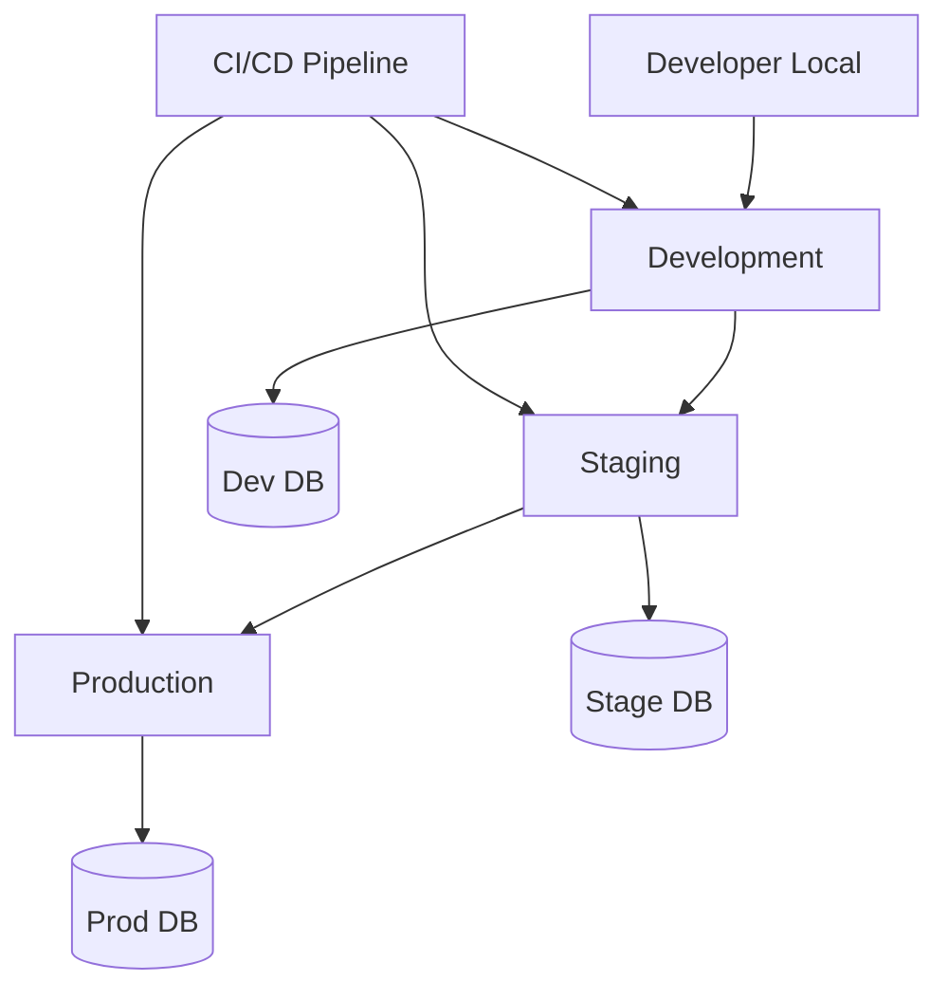

# 🌍 환경 관리

> Korea Public Data 프로젝트의 다중 환경 구성 및 관리 전략

## 📋 목차
- [환경 구성 개요](#환경-구성-개요)
- [환경별 상세 구성](#환경별-상세-구성)
- [설정 파일 관리](#설정-파일-관리)
- [데이터베이스 관리](#데이터베이스-관리)
- [보안 및 시크릿 관리](#보안-및-시크릿-관리)
- [환경 간 데이터 동기화](#환경-간-데이터-동기화)
- [모니터링 및 로깅](#모니터링-및-로깅)

## 🏗 환경 구성 개요

### 환경 아키텍처


### 환경 매트릭스
| 환경 | 목적 | 브랜치 | 배포 방식 | 데이터 |
|------|------|--------|-----------|--------|
| **Local** | 개발자 로컬 개발 | feature/* | Manual | Mock/Seed |
| **Development** | 개발 통합 테스트 | develop | Auto (CI) | Test Data |
| **Staging** | UAT/성능 테스트 | staging | Auto (CI) | Production-like |
| **Production** | 실제 서비스 | main | Manual Approval | Real Data |

## 🚀 환경별 상세 구성

### Local Development
```yaml
# docker-compose.local.yml
version: '3.8'
services:
  frontend:
    build: ./fe
    ports:
      - "3000:3000"
    environment:
      - NODE_ENV=development
      - NEXT_PUBLIC_API_URL=http://localhost:8000
      - NEXT_PUBLIC_ENVIRONMENT=local
    volumes:
      - ./fe:/app
      - /app/node_modules

  backend:
    build: ./be
    ports:
      - "8000:8000"
    environment:
      - ENVIRONMENT=local
      - DEBUG=True
      - DATABASE_URL=mongodb://mongodb:27017/korea_public_api_local
      - REDIS_URL=redis://redis:6379/0
    volumes:
      - ./be:/app
    depends_on:
      - mongodb
      - redis

  mongodb:
    image: mongo:6.0
    ports:
      - "27017:27017"
    volumes:
      - mongo_local_data:/data/db
    environment:
      - MONGO_INITDB_ROOT_USERNAME=admin
      - MONGO_INITDB_ROOT_PASSWORD=password
      - MONGO_INITDB_DATABASE=korea_public_api_local

  redis:
    image: redis:7-alpine
    ports:
      - "6379:6379"
    volumes:
      - redis_local_data:/data
```

### Development Environment
```yaml
# k8s/development/namespace.yml
apiVersion: v1
kind: Namespace
metadata:
  name: korea-dev
  labels:
    environment: development

---
# k8s/development/configmap.yml
apiVersion: v1
kind: ConfigMap
metadata:
  name: korea-config
  namespace: korea-dev
data:
  NODE_ENV: "development"
  API_URL: "https://api-dev.korea-public-data.com"
  DATABASE_NAME: "korea_public_api_dev"
  LOG_LEVEL: "DEBUG"
  RATE_LIMIT_REQUESTS: "1000"
  CACHE_TTL: "300"

---
# k8s/development/deployment.yml
apiVersion: apps/v1
kind: Deployment
metadata:
  name: korea-frontend
  namespace: korea-dev
spec:
  replicas: 2
  selector:
    matchLabels:
      app: korea-frontend
      environment: development
  template:
    metadata:
      labels:
        app: korea-frontend
        environment: development
    spec:
      containers:
        - name: frontend
          image: korea-fe:develop
          ports:
            - containerPort: 3000
          envFrom:
            - configMapRef:
                name: korea-config
            - secretRef:
                name: korea-secrets
          resources:
            requests:
              memory: "256Mi"
              cpu: "250m"
            limits:
              memory: "512Mi"
              cpu: "500m"
```

### Staging Environment
```yaml
# k8s/staging/deployment.yml
apiVersion: apps/v1
kind: Deployment
metadata:
  name: korea-backend
  namespace: korea-staging
spec:
  replicas: 3
  selector:
    matchLabels:
      app: korea-backend
      environment: staging
  template:
    spec:
      containers:
        - name: backend
          image: korea-be:staging
          ports:
            - containerPort: 8000
          env:
            - name: ENVIRONMENT
              value: "staging"
            - name: DATABASE_URL
              valueFrom:
                secretKeyRef:
                  name: korea-secrets
                  key: database-url
          resources:
            requests:
              memory: "512Mi"
              cpu: "500m"
            limits:
              memory: "1Gi"
              cpu: "1000m"
          readinessProbe:
            httpGet:
              path: /health
              port: 8000
            initialDelaySeconds: 10
            periodSeconds: 5
          livenessProbe:
            httpGet:
              path: /health
              port: 8000
            initialDelaySeconds: 30
            periodSeconds: 10
```

### Production Environment
```yaml
# k8s/production/deployment.yml
apiVersion: apps/v1
kind: Deployment
metadata:
  name: korea-backend
  namespace: korea-prod
spec:
  replicas: 5
  strategy:
    type: RollingUpdate
    rollingUpdate:
      maxUnavailable: 1
      maxSurge: 1
  selector:
    matchLabels:
      app: korea-backend
      environment: production
  template:
    spec:
      containers:
        - name: backend
          image: korea-be:latest
          ports:
            - containerPort: 8000
          env:
            - name: ENVIRONMENT
              value: "production"
          resources:
            requests:
              memory: "1Gi"
              cpu: "1000m"
            limits:
              memory: "2Gi"
              cpu: "2000m"
          securityContext:
            readOnlyRootFilesystem: true
            runAsNonRoot: true
            runAsUser: 1000
```

## ⚙️ 설정 파일 관리

### Frontend 환경 설정
```typescript
// fe/src/config/env.ts
const environments = {
  local: {
    apiUrl: 'http://localhost:8000',
    logLevel: 'debug',
    enableDevTools: true,
  },
  development: {
    apiUrl: 'https://api-dev.korea-public-data.com',
    logLevel: 'info',
    enableDevTools: true,
  },
  staging: {
    apiUrl: 'https://api-staging.korea-public-data.com',
    logLevel: 'warn',
    enableDevTools: false,
  },
  production: {
    apiUrl: 'https://api.korea-public-data.com',
    logLevel: 'error',
    enableDevTools: false,
  },
};

export const config = environments[process.env.NEXT_PUBLIC_ENVIRONMENT || 'local'];
```

### Backend 환경 설정
```python
# be/app/core/config.py
import os
from typing import Literal
from pydantic_settings import BaseSettings

EnvironmentType = Literal['local', 'development', 'staging', 'production']

class Settings(BaseSettings):
    environment: EnvironmentType = 'local'
    debug: bool = False
    
    # Database
    database_url: str
    database_name: str = 'korea_public_api'
    
    # Redis
    redis_url: str = 'redis://localhost:6379/0'
    
    # API Keys
    public_data_api_key: str
    google_oauth_client_id: str
    
    # Security
    secret_key: str
    jwt_expiry_minutes: int = 30
    
    # Rate Limiting
    rate_limit_requests: int = 100
    rate_limit_window: int = 60
    
    # Logging
    log_level: str = 'INFO'
    
    # External APIs
    kstartup_api_url: str = 'https://api.k-startup.go.kr'
    
    class Config:
        env_file = f".env.{os.getenv('ENVIRONMENT', 'local')}"

# Environment-specific configurations
class LocalSettings(Settings):
    debug: bool = True
    log_level: str = 'DEBUG'

class DevelopmentSettings(Settings):
    debug: bool = True
    log_level: str = 'DEBUG'

class StagingSettings(Settings):
    debug: bool = False
    log_level: str = 'INFO'

class ProductionSettings(Settings):
    debug: bool = False
    log_level: str = 'WARNING'
    
    # Production-specific security settings
    jwt_expiry_minutes: int = 15
    rate_limit_requests: int = 50

def get_settings() -> Settings:
    env = os.getenv('ENVIRONMENT', 'local')
    settings_map = {
        'local': LocalSettings,
        'development': DevelopmentSettings, 
        'staging': StagingSettings,
        'production': ProductionSettings,
    }
    return settings_map[env]()

settings = get_settings()
```

## 🗄️ 데이터베이스 관리

### 환경별 데이터베이스 구성
```yaml
# Database Configuration Matrix
environments:
  local:
    type: "MongoDB"
    host: "localhost"
    port: 27017
    database: "korea_public_api_local"
    username: "admin"
    replica_set: false
    
  development:
    type: "MongoDB Atlas"
    connection_string: "${DEV_DATABASE_URL}"
    database: "korea_public_api_dev"
    replica_set: true
    read_preference: "primaryPreferred"
    
  staging:
    type: "MongoDB Atlas"
    connection_string: "${STAGING_DATABASE_URL}"
    database: "korea_public_api_staging"
    replica_set: true
    read_preference: "secondary"
    
  production:
    type: "MongoDB Atlas"
    connection_string: "${PROD_DATABASE_URL}"
    database: "korea_public_api_prod"
    replica_set: true
    read_preference: "primary"
    backup_enabled: true
    point_in_time_recovery: true
```

### 마이그레이션 관리
```python
# be/scripts/migrate.py
import asyncio
import os
from motor.motor_asyncio import AsyncIOMotorClient
from app.core.config import settings

async def run_migration(environment: str, migration_name: str):
    """Run database migration for specific environment"""
    
    client = AsyncIOMotorClient(settings.database_url)
    db = client[settings.database_name]
    
    # Check migration history
    migrations = db.migrations
    existing = await migrations.find_one({"name": migration_name})
    
    if existing:
        print(f"Migration {migration_name} already applied")
        return
    
    # Apply migration based on environment
    if environment == "local":
        await apply_local_migration(db, migration_name)
    elif environment == "development":
        await apply_dev_migration(db, migration_name)
    elif environment in ["staging", "production"]:
        await apply_prod_migration(db, migration_name)
    
    # Record migration
    await migrations.insert_one({
        "name": migration_name,
        "applied_at": datetime.utcnow(),
        "environment": environment
    })
    
    print(f"Migration {migration_name} applied successfully")
```

## 🔐 보안 및 시크릿 관리

### Kubernetes Secrets
```yaml
# k8s/base/secrets.yml
apiVersion: external-secrets.io/v1beta1
kind: SecretStore
metadata:
  name: vault-backend
spec:
  provider:
    vault:
      server: "https://vault.company.com"
      path: "secret"
      version: "v2"
      auth:
        kubernetes:
          mountPath: "kubernetes"
          role: "korea-public-data"

---
apiVersion: external-secrets.io/v1beta1
kind: ExternalSecret
metadata:
  name: korea-secrets
spec:
  refreshInterval: 15s
  secretStoreRef:
    name: vault-backend
    kind: SecretStore
  target:
    name: korea-secrets
    creationPolicy: Owner
  data:
    - secretKey: database-url
      remoteRef:
        key: korea-public-data
        property: database_url
    - secretKey: redis-url
      remoteRef:
        key: korea-public-data
        property: redis_url
```

### 환경별 시크릿 분리
```bash
# Development Secrets
kubectl create secret generic korea-secrets \
  --from-literal=database-url="mongodb://dev-cluster/korea_dev" \
  --from-literal=jwt-secret="dev-jwt-secret-key" \
  --from-literal=api-key="dev-api-key" \
  --namespace=korea-dev

# Production Secrets
kubectl create secret generic korea-secrets \
  --from-literal=database-url="mongodb://prod-cluster/korea_prod" \
  --from-literal=jwt-secret="$(openssl rand -base64 32)" \
  --from-literal=api-key="prod-api-key" \
  --namespace=korea-prod
```

## 🔄 환경 간 데이터 동기화

### 데이터 동기화 스크립트
```python
# scripts/sync_data.py
import asyncio
from typing import Literal
from motor.motor_asyncio import AsyncIOMotorClient

EnvironmentType = Literal['dev', 'staging', 'prod']

async def sync_environments(
    source: EnvironmentType, 
    target: EnvironmentType,
    collections: list[str] = None
):
    """Sync data between environments"""
    
    # Connect to source and target
    source_client = AsyncIOMotorClient(get_db_url(source))
    target_client = AsyncIOMotorClient(get_db_url(target))
    
    source_db = source_client[f"korea_public_api_{source}"]
    target_db = target_client[f"korea_public_api_{target}"]
    
    collections = collections or ["announcements", "businesses", "users"]
    
    for collection_name in collections:
        print(f"Syncing {collection_name}...")
        
        # Clear target collection (if not production)
        if target != 'prod':
            await target_db[collection_name].delete_many({})
        
        # Copy data
        async for document in source_db[collection_name].find():
            # Remove _id to avoid conflicts
            document.pop('_id', None)
            
            # Anonymize sensitive data for non-production
            if target != 'prod':
                document = anonymize_document(document)
            
            await target_db[collection_name].insert_one(document)
        
        print(f"Synced {collection_name} successfully")

def anonymize_document(doc: dict) -> dict:
    """Remove or anonymize sensitive information"""
    if 'email' in doc:
        doc['email'] = f"test_{doc['email'].split('@')[0]}@example.com"
    if 'phone' in doc:
        doc['phone'] = "010-1234-5678"
    return doc
```

### 환경 전환 체크리스트
```yaml
# Environment Switch Checklist
pre_switch:
  - name: "Database backup"
    command: "mongodump --uri=$SOURCE_DB_URL"
    required: true
    
  - name: "Configuration validation"
    command: "./scripts/validate-config.sh $TARGET_ENV"
    required: true
    
  - name: "Health check"
    command: "curl -f $TARGET_ENV_URL/health"
    required: true

post_switch:
  - name: "Smoke tests"
    command: "npm run test:smoke -- --env=$TARGET_ENV"
    required: true
    
  - name: "Performance check"
    command: "./scripts/performance-test.sh $TARGET_ENV"
    required: false
    
  - name: "Monitor alerts"
    command: "sleep 300 && ./scripts/check-alerts.sh"
    required: true
```

## 📊 모니터링 및 로깅

### 환경별 모니터링 설정
```yaml
# monitoring/prometheus-rules.yml
groups:
  - name: environment-specific
    rules:
      # Development - Relaxed thresholds
      - alert: HighResponseTime-Dev
        expr: histogram_quantile(0.95, http_request_duration_seconds) > 2
        for: 5m
        labels:
          severity: warning
          environment: development
      
      # Production - Strict thresholds
      - alert: HighResponseTime-Prod
        expr: histogram_quantile(0.95, http_request_duration_seconds) > 0.5
        for: 1m
        labels:
          severity: critical
          environment: production
```

### 로그 수집 및 분석
```yaml
# logging/fluent-bit-config.yml
apiVersion: v1
kind: ConfigMap
metadata:
  name: fluent-bit-config
data:
  fluent-bit.conf: |
    [INPUT]
        Name              tail
        Path              /var/log/containers/*korea*
        Parser            docker
        Tag               korea.*
        Refresh_Interval  5
    
    [FILTER]
        Name                kubernetes
        Match               korea.*
        Kube_URL            https://kubernetes.default.svc:443
        Kube_CA_File        /var/run/secrets/kubernetes.io/serviceaccount/ca.crt
        Kube_Token_File     /var/run/secrets/kubernetes.io/serviceaccount/token
    
    [OUTPUT]
        Name  es
        Match *
        Host  elasticsearch.logging.svc.cluster.local
        Port  9200
        Index korea-logs-${ENVIRONMENT}
```

## 🛠 환경 관리 도구

### 환경 설정 검증 스크립트
```bash
#!/bin/bash
# scripts/validate-environment.sh

ENVIRONMENT=${1:-development}

echo "🔍 Validating $ENVIRONMENT environment..."

# Check required environment variables
required_vars=(
    "DATABASE_URL"
    "REDIS_URL" 
    "PUBLIC_DATA_API_KEY"
    "JWT_SECRET"
)

for var in "${required_vars[@]}"; do
    if [ -z "${!var}" ]; then
        echo "❌ Missing required variable: $var"
        exit 1
    fi
done

# Validate database connection
echo "📊 Testing database connection..."
python -c "
import asyncio
from motor.motor_asyncio import AsyncIOMotorClient
async def test_db():
    client = AsyncIOMotorClient('$DATABASE_URL')
    await client.admin.command('ping')
    print('✅ Database connection successful')
asyncio.run(test_db())
"

# Validate external APIs
echo "🌐 Testing external API connections..."
curl -f "$KSTARTUP_API_URL/health" || echo "⚠️ K-Startup API connection failed"

echo "✅ Environment validation completed"
```

## 📋 환경 상태 대시보드

| 환경 | 상태 | 버전 | 마지막 배포 | CPU | Memory | 응답시간 |
|------|------|------|-------------|-----|---------|----------|
| Development | 🟢 Running | v1.2.0-dev | 2025-08-14 10:30 | 45% | 60% | 150ms |
| Staging | 🟢 Running | v1.1.5 | 2025-08-13 15:20 | 30% | 40% | 120ms |
| Production | 🟢 Running | v1.1.4 | 2025-08-12 09:00 | 25% | 35% | 80ms |

## 🔄 업데이트 이력

| 버전 | 날짜 | 변경사항 | 작성자 |
|------|------|----------|--------|
| 1.0.0 | 2025-08-14 | 초기 환경 관리 구조 수립 | PM |

---

*본 환경 관리 문서는 프로젝트 인프라 변경사항에 따라 지속적으로 업데이트되며, 모든 환경 변경은 정의된 프로세스를 준수해야 합니다.*