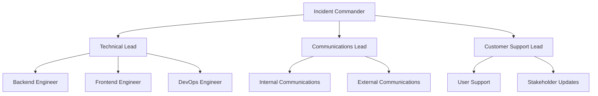
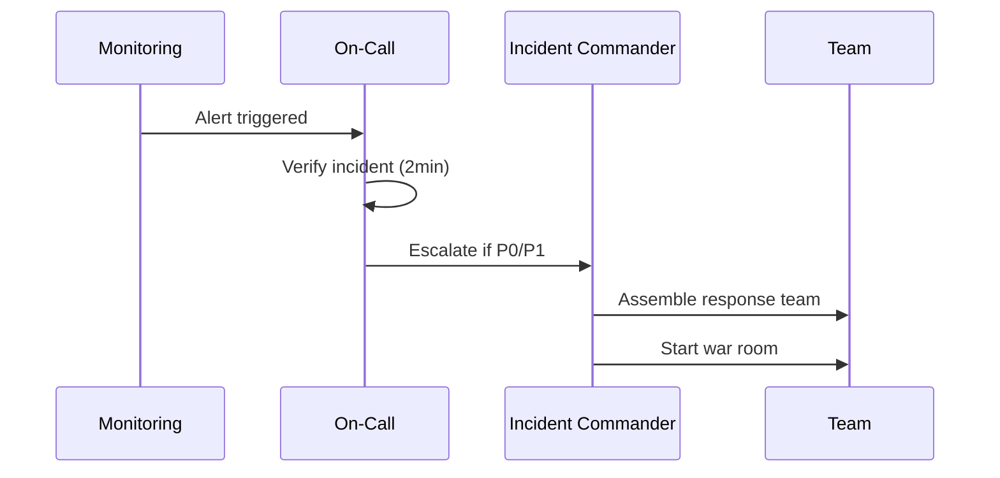

# 🚨 장애 대응 매뉴얼

> Korea Public Data 프로젝트의 신속하고 체계적인 장애 대응을 위한 종합 가이드

## 📋 목차
- [장애 대응 개요](#장애-대응-개요)
- [장애 분류 체계](#장애-분류-체계)
- [대응 조직 구성](#대응-조직-구성)
- [장애 대응 절차](#장애-대응-절차)
- [장애 유형별 대응](#장애-유형별-대응)
- [커뮤니케이션 계획](#커뮤니케이션-계획)
- [복구 전략](#복구-전략)
- [사후 분석](#사후-분석)

## 🎯 장애 대응 개요

### 핵심 원칙
1. **Safety First**: 사용자 안전과 데이터 보호 최우선
2. **Fast Response**: 신속한 초기 대응 (5분 이내)
3. **Clear Communication**: 명확하고 투명한 소통
4. **Learn & Improve**: 지속적인 개선과 학습

### 대응 목표
- **Detection**: 장애 감지 시간 < 5분
- **Response**: 초기 대응 시간 < 10분  
- **Recovery**: 서비스 복구 시간 < 30분
- **Communication**: 상황 공유 시간 < 15분

## 🏷 장애 분류 체계

### 심각도 분류
| 레벨 | 명칭 | 정의 | 예시 | 목표 복구 시간 |
|------|------|------|------|----------------|
| **P0** | Critical | 전체 서비스 중단 | 서버 다운, DB 장애 | 30분 |
| **P1** | High | 핵심 기능 장애 | 로그인 불가, 검색 오류 | 2시간 |
| **P2** | Medium | 부분 기능 장애 | UI 오류, 성능 저하 | 1일 |
| **P3** | Low | 경미한 이슈 | 표시 오류, 로깅 문제 | 1주 |

### 장애 유형 분류
```yaml
incident_types:
  infrastructure:
    - server_down: "서버 다운"
    - network_issue: "네트워크 장애"
    - database_failure: "데이터베이스 장애"
    - storage_full: "스토리지 부족"
  
  application:
    - deployment_failure: "배포 실패"
    - memory_leak: "메모리 누수"
    - infinite_loop: "무한 루프"
    - api_timeout: "API 타임아웃"
  
  security:
    - ddos_attack: "DDoS 공격"
    - data_breach: "데이터 유출"
    - unauthorized_access: "무단 접근"
    - malware_detected: "악성코드 탐지"
  
  external:
    - third_party_outage: "외부 서비스 장애"
    - dns_issue: "DNS 문제"
    - cdn_failure: "CDN 장애"
    - payment_gateway: "결제 게이트웨이 문제"
```

## 👥 대응 조직 구성

### Incident Response Team (IRT)


### 역할별 책임
| 역할 | 담당자 | 연락처 | 주요 책임 |
|------|--------|--------|----------|
| **Incident Commander** | PM | #pm-contact | 전체 대응 총괄, 의사결정 |
| **Technical Lead** | Senior Dev | #tech-lead | 기술적 해결 방안 수립 |
| **Communications Lead** | Marketing | #comms-team | 내외부 커뮤니케이션 |
| **Backend Engineer** | Backend Team | #backend-team | 서버 사이드 이슈 해결 |
| **Frontend Engineer** | Frontend Team | #frontend-team | 클라이언트 사이드 이슈 해결 |
| **DevOps Engineer** | DevOps Team | #devops-team | 인프라 및 배포 이슈 해결 |

### 24/7 On-Call 순환표
| 주차 | Primary On-Call | Secondary On-Call | Escalation |
|------|-----------------|-------------------|------------|
| Week 1 | Backend-A | Frontend-A | Tech Lead |
| Week 2 | Backend-B | Frontend-B | Tech Lead |
| Week 3 | DevOps-A | Backend-A | Tech Lead |
| Week 4 | DevOps-B | Frontend-A | Tech Lead |

## 🚨 장애 대응 절차

### Phase 1: 감지 및 초기 대응 (0-10분)


#### 1.1 알림 수신 및 확인
```bash
# 장애 확인 체크리스트
□ 모니터링 대시보드 확인
□ 알림 심각도 평가
□ 사용자 영향도 확인
□ 초기 원인 추정

# 즉시 실행해야 할 명령어
kubectl get pods -n korea-prod
curl -f https://api.korea-public-data.com/health
tail -f /var/log/application.log
```

#### 1.2 초기 대응팀 소집
```yaml
# Slack 자동 메시지 템플릿
incident_notification:
  channel: "#critical-alerts"
  message: |
    🚨 **INCIDENT ALERT** 🚨
    
    **Severity**: {{severity}}
    **Description**: {{description}}
    **Affected Services**: {{services}}
    **On-Call Engineer**: {{oncall_engineer}}
    
    War Room: {{war_room_link}}
    Status Page: {{status_page_link}}
    
    @here Please join the war room if you're part of the response team.
```

### Phase 2: 분석 및 진단 (10-30분)
#### 2.1 상황 분석
```python
# 장애 분석 스크립트
# scripts/incident_analysis.py

import requests
import subprocess
import json
from datetime import datetime, timedelta

class IncidentAnalyzer:
    def __init__(self):
        self.start_time = datetime.now()
        self.findings = []
    
    def check_system_health(self):
        """시스템 전반적 상태 확인"""
        checks = {
            'api_health': self.check_api_health(),
            'database': self.check_database(),
            'external_services': self.check_external_services(),
            'infrastructure': self.check_infrastructure()
        }
        return checks
    
    def check_api_health(self):
        """API 상태 확인"""
        try:
            response = requests.get('https://api.korea-public-data.com/health', timeout=5)
            return {
                'status': 'healthy' if response.status_code == 200 else 'unhealthy',
                'response_time': response.elapsed.total_seconds(),
                'status_code': response.status_code
            }
        except Exception as e:
            return {'status': 'error', 'error': str(e)}
    
    def generate_incident_report(self):
        """장애 초기 보고서 생성"""
        health_check = self.check_system_health()
        
        report = {
            'incident_id': f"INC-{datetime.now().strftime('%Y%m%d-%H%M%S')}",
            'start_time': self.start_time.isoformat(),
            'severity': self.assess_severity(health_check),
            'affected_components': self.get_affected_components(health_check),
            'initial_findings': self.findings,
            'next_actions': self.suggest_next_actions(health_check)
        }
        
        return report
```

#### 2.2 로그 분석 자동화
```bash
#!/bin/bash
# scripts/log_analysis.sh

INCIDENT_TIME=${1:-"5 minutes ago"}
NAMESPACE="korea-prod"

echo "🔍 Analyzing logs since $INCIDENT_TIME"

# 최근 에러 로그 추출
echo "📊 Recent error patterns:"
kubectl logs -n $NAMESPACE --since="$INCIDENT_TIME" -l app=korea-backend | \
  grep -i error | \
  sort | uniq -c | sort -nr | head -10

# 높은 CPU/Memory 사용률 파드 확인
echo "📈 Resource usage:"
kubectl top pods -n $NAMESPACE --sort-by=cpu

# 서비스 연결성 확인
echo "🌐 Service connectivity:"
for service in frontend backend mongodb redis; do
  kubectl exec -n $NAMESPACE deploy/korea-backend -- \
    curl -f http://$service:8080/health 2>/dev/null && \
    echo "$service: ✅" || echo "$service: ❌"
done
```

### Phase 3: 대응 및 복구 (30분-2시간)
#### 3.1 긴급 복구 조치
```yaml
# 일반적인 복구 시나리오
recovery_playbooks:
  high_cpu_usage:
    - action: "Scale up pods"
      command: "kubectl scale deployment korea-backend --replicas=10"
    - action: "Restart problematic pods"
      command: "kubectl rollout restart deployment/korea-backend"
  
  database_connection_issues:
    - action: "Check connection pool"
      command: "./scripts/check_db_pool.py"
    - action: "Restart database connections"
      command: "kubectl delete pods -l app=korea-backend"
  
  external_api_timeout:
    - action: "Enable circuit breaker"
      command: "kubectl patch configmap api-config --patch '{\"data\":{\"circuit_breaker\":\"true\"}}'"
    - action: "Switch to backup service"
      command: "./scripts/failover_external_api.sh"
```

#### 3.2 롤백 절차
```bash
#!/bin/bash
# scripts/emergency_rollback.sh

echo "🔄 Starting emergency rollback..."

# 현재 배포 버전 확인
CURRENT_VERSION=$(kubectl get deployment korea-backend -o jsonpath='{.spec.template.spec.containers[0].image}')
echo "Current version: $CURRENT_VERSION"

# 이전 버전 확인
PREVIOUS_VERSION=$(kubectl rollout history deployment/korea-backend | tail -n 2 | head -n 1)
echo "Rolling back to: $PREVIOUS_VERSION"

# 롤백 실행
kubectl rollout undo deployment/korea-backend --to-revision=$PREVIOUS_VERSION

# 롤백 상태 확인
kubectl rollout status deployment/korea-backend --timeout=300s

if [ $? -eq 0 ]; then
    echo "✅ Rollback completed successfully"
    
    # 헬스 체크
    sleep 30
    curl -f https://api.korea-public-data.com/health && \
        echo "✅ Service health check passed" || \
        echo "❌ Service health check failed"
else
    echo "❌ Rollback failed - manual intervention required"
    exit 1
fi
```

## 🔧 장애 유형별 대응

### 1. 서버 다운 (P0)
```yaml
server_down_response:
  immediate_actions:
    - "Load balancer에서 문제 서버 제거"
    - "트래픽을 정상 서버로 라우팅"
    - "서버 재시작 시도"
  
  investigation:
    - "서버 리소스 사용량 확인"
    - "시스템 로그 분석"
    - "하드웨어 상태 점검"
  
  recovery:
    - "서버 재시작 또는 교체"
    - "서비스 정상화 확인"
    - "Load balancer에 서버 재등록"
```

### 2. 데이터베이스 장애 (P0)
```python
# scripts/db_emergency_response.py

async def handle_database_incident():
    """데이터베이스 장애 대응"""
    
    # 1. 읽기 전용 모드 활성화
    await enable_read_only_mode()
    
    # 2. 캐시 TTL 연장
    await extend_cache_ttl(hours=2)
    
    # 3. 데이터베이스 연결 상태 확인
    db_status = await check_database_connections()
    
    # 4. 백업에서 복구 준비
    if db_status.is_critical():
        await prepare_backup_restore()
    
    # 5. 사용자 공지
    await send_user_notification(
        message="시스템 점검으로 인해 일부 기능이 제한될 수 있습니다.",
        severity="high"
    )
```

### 3. 보안 장애 (P0)
```bash
#!/bin/bash
# scripts/security_incident_response.sh

echo "🛡️ Security incident response initiated"

# 1. 즉시 격리
kubectl scale deployment suspicious-pods --replicas=0
iptables -A INPUT -s $MALICIOUS_IP -j DROP

# 2. 로그 보존
kubectl logs -n korea-prod --all-containers=true > /backup/incident-logs-$(date +%Y%m%d-%H%M%S).log

# 3. 네트워크 트래픽 모니터링
tcpdump -i any -w /backup/network-capture-$(date +%Y%m%d-%H%M%S).pcap &

# 4. 사용자 세션 무효화
kubectl exec deploy/korea-backend -- python -c "
from app.core.auth import invalidate_all_sessions
invalidate_all_sessions()
"

# 5. 보안팀 자동 알림
curl -X POST $SECURITY_WEBHOOK \
  -H "Content-Type: application/json" \
  -d "{\"alert\": \"Security incident detected\", \"severity\": \"critical\"}"
```

## 📢 커뮤니케이션 계획

### 내부 커뮤니케이션
```yaml
internal_communications:
  immediate_team:
    channels: ["#critical-alerts", "#war-room"]
    frequency: "Real-time updates"
    template: |
      **Update**: {{timestamp}}
      **Status**: {{current_status}}
      **Actions Taken**: {{actions}}
      **Next Steps**: {{next_steps}}
      **ETA**: {{estimated_resolution}}

  management:
    channels: ["#leadership", "Email"]
    frequency: "Every 30 minutes"
    template: |
      **Incident Summary**
      - Severity: {{severity}}
      - Impact: {{user_impact}}
      - Current Status: {{status}}
      - Expected Resolution: {{eta}}
```

### 외부 커뮤니케이션
```yaml
external_communications:
  status_page:
    url: "https://status.korea-public-data.com"
    update_frequency: "Every 15 minutes"
    
  social_media:
    platforms: ["Twitter", "Facebook"]
    criteria: "P0/P1 incidents affecting >50% users"
    
  user_notifications:
    channels: ["In-app", "Email", "SMS"]
    criteria: "Service disruption >30 minutes"
    
  press_release:
    criteria: "Data breach or security incidents"
    approval: "CEO approval required"
```

### 상황별 메시지 템플릿
```markdown
# P0 장애 - 초기 공지
🚨 **서비스 장애 안내**

현재 Korea Public Data 서비스에 일시적인 장애가 발생하여 접속이 어려우실 수 있습니다.

- 발생 시간: 2025-08-14 14:30 (KST)
- 영향 범위: 전체 서비스
- 예상 복구: 30분 이내

신속한 복구를 위해 최선을 다하고 있으며, 복구 진행 상황은 지속적으로 업데이트해드리겠습니다.

# P0 장애 - 복구 완료
✅ **서비스 정상화 완료**

Korea Public Data 서비스가 정상 복구되었습니다.

- 복구 완료: 2025-08-14 15:15 (KST)
- 장애 지속 시간: 45분
- 원인: 데이터베이스 연결 장애

이용에 불편을 드려 죄송합니다. 재발 방지를 위한 개선 작업을 진행하겠습니다.
```

## 🔄 복구 전략

### 복구 우선순위
1. **사용자 안전 확보**: 데이터 보호 및 보안 위협 제거
2. **핵심 기능 복구**: 로그인, 검색, 공고 조회
3. **부가 기능 복구**: 알림, 통계, 관리 기능
4. **성능 최적화**: 응답 시간 및 처리량 정상화

### 복구 검증 체크리스트
```yaml
recovery_verification:
  smoke_tests:
    - name: "User login"
      command: "npm run test:login"
      success_criteria: "100% pass rate"
    
    - name: "Search functionality"  
      command: "npm run test:search"
      success_criteria: "Response time < 2s"
    
    - name: "Database queries"
      command: "python test_db_queries.py"
      success_criteria: "All queries successful"
  
  performance_tests:
    - name: "Load test"
      command: "artillery run load-test.yml"
      success_criteria: "95th percentile < 500ms"
    
    - name: "Stress test"
      command: "k6 run stress-test.js"
      success_criteria: "Error rate < 1%"
  
  monitoring_checks:
    - name: "Alert silence"
      check: "No critical alerts for 15 minutes"
    
    - name: "Error rate"
      check: "Error rate < 0.1%"
    
    - name: "Response time"
      check: "95th percentile < 200ms"
```

## 📊 사후 분석 (Post-Mortem)

### Post-Mortem 템플릿
```markdown
# Incident Post-Mortem

**Incident ID**: INC-2025081401
**Date**: 2025-08-14  
**Duration**: 45 minutes
**Severity**: P0

## Summary
Brief description of what happened and the impact.

## Timeline
| Time | Event | Actions Taken |
|------|-------|---------------|
| 14:30 | Alert triggered | On-call engineer notified |
| 14:35 | Investigation began | War room established |
| 14:45 | Root cause identified | Rollback initiated |
| 15:15 | Service restored | Monitoring confirmed |

## Root Cause Analysis
### What went wrong?
Detailed technical explanation of the root cause.

### Why did it happen?
Contributing factors and underlying causes.

## Impact Assessment
- Users affected: X,XXX users
- Revenue impact: $X,XXX
- SLA breach: X minutes beyond target

## What went well?
- Quick detection (5 minutes)
- Effective team coordination
- Successful rollback

## What could be improved?
- Monitoring coverage gaps
- Communication delays
- Recovery procedures

## Action Items
| Action | Owner | Due Date | Priority |
|--------|--------|----------|----------|
| Improve monitoring | DevOps Team | 2025-08-21 | High |
| Update runbook | On-call Team | 2025-08-18 | Medium |

## Lessons Learned
Key takeaways and preventive measures.
```

### 개선사항 추적
```yaml
improvement_tracking:
  preventive_measures:
    - item: "Enhanced monitoring for DB connections"
      status: "In Progress"
      owner: "DevOps Team"
      due_date: "2025-08-21"
    
    - item: "Automated rollback triggers"
      status: "Planned"
      owner: "Backend Team"
      due_date: "2025-08-28"
  
  process_improvements:
    - item: "Incident response training"
      status: "Scheduled"
      owner: "PM"
      due_date: "2025-08-25"
```

## 📚 참고 자료

### 긴급 연락처
| 역할 | 담당자 | 전화번호 | 이메일 |
|------|--------|----------|--------|
| Incident Commander | PM | 010-XXXX-XXXX | pm@company.com |
| Technical Lead | Senior Dev | 010-XXXX-XXXX | tech-lead@company.com |
| DevOps Lead | DevOps | 010-XXXX-XXXX | devops@company.com |

### 유용한 도구 및 링크
- **Status Page**: https://status.korea-public-data.com
- **Monitoring**: https://monitoring.korea-public-data.com
- **War Room**: https://meet.google.com/war-room
- **Incident Tracker**: https://jira.company.com/incidents

## 🔄 업데이트 이력

| 버전 | 날짜 | 변경사항 | 작성자 |
|------|------|----------|--------|
| 1.0.0 | 2025-08-14 | 초기 장애 대응 매뉴얼 작성 | PM |

---

*본 장애 대응 매뉴얼은 실제 장애 대응 경험을 바탕으로 지속적으로 개선되며, 모든 팀원은 정기적인 훈련을 통해 대응 능력을 향상시켜야 합니다.*