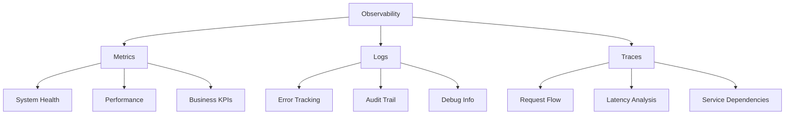
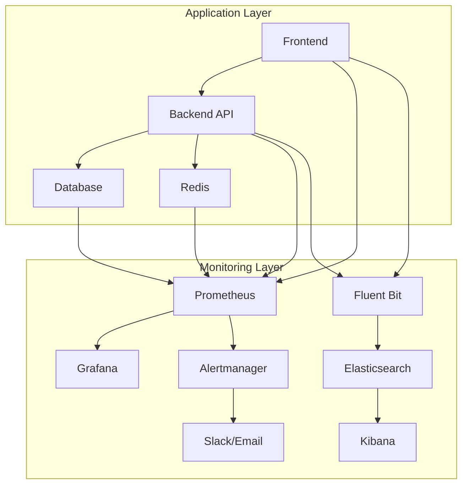

# 📊 모니터링 전략

> Korea Public Data 프로젝트의 종합적인 시스템 모니터링 및 관측 가능성 전략

## 📋 목차
- [모니터링 개요](#모니터링-개요)
- [모니터링 스택](#모니터링-스택)
- [메트릭 수집](#메트릭-수집)
- [로깅 전략](#로깅-전략)
- [알림 및 경고](#알림-및-경고)
- [대시보드 구성](#대시보드-구성)
- [SLA/SLO 정의](#sla-slo-정의)
- [성능 추적](#성능-추적)

## 🎯 모니터링 개요

### 모니터링 목표
1. **Proactive Issue Detection**: 문제 사전 감지 및 예방
2. **Performance Optimization**: 성능 병목 지점 식별 및 개선
3. **User Experience**: 사용자 경험 품질 측정
4. **Business Metrics**: 비즈니스 KPI 추적

### Three Pillars of Observability


## 🛠 모니터링 스택

### 핵심 도구
```yaml
monitoring_stack:
  metrics:
    - name: "Prometheus"
      purpose: "메트릭 수집 및 저장"
      retention: "30일"
    
    - name: "Grafana"
      purpose: "시각화 및 대시보드"
      version: "10.x"
  
  logs:
    - name: "Fluent Bit"
      purpose: "로그 수집"
      config: "kubernetes-optimized"
    
    - name: "Elasticsearch"
      purpose: "로그 저장 및 검색"
      retention: "90일"
    
    - name: "Kibana"
      purpose: "로그 분석 및 시각화"
  
  traces:
    - name: "Jaeger"
      purpose: "분산 트레이싱"
      sampling_rate: "1%"
  
  alerting:
    - name: "Alertmanager"
      purpose: "알림 관리"
      channels: ["Slack", "Email", "PagerDuty"]
```

### 아키텍처 다이어그램


## 📈 메트릭 수집

### Application Metrics
```typescript
// Frontend - Next.js 메트릭
// fe/src/lib/monitoring/metrics.ts
import { NextWebVitalsMetric } from 'next/app';

export function reportWebVitals(metric: NextWebVitalsMetric) {
  const url = '/api/analytics';
  
  const body = JSON.stringify({
    metric_name: metric.name,
    metric_value: metric.value,
    metric_id: metric.id,
    page: window.location.pathname,
    timestamp: Date.now()
  });

  // Use sendBeacon for reliability
  if (navigator.sendBeacon) {
    navigator.sendBeacon(url, body);
  } else {
    fetch(url, { body, method: 'POST' });
  }
}

// Custom business metrics
export const trackUserAction = (action: string, properties?: object) => {
  // Track user interactions for business intelligence
  window.gtag?.('event', action, {
    ...properties,
    timestamp: Date.now()
  });
};
```

```python
# Backend - FastAPI 메트릭
# be/app/core/metrics.py
from prometheus_client import Counter, Histogram, Gauge
import time
from functools import wraps

# Business Metrics
api_requests_total = Counter(
    'api_requests_total',
    'Total API requests',
    ['method', 'endpoint', 'status_code']
)

api_request_duration = Histogram(
    'api_request_duration_seconds',
    'API request duration',
    ['method', 'endpoint']
)

active_users = Gauge(
    'active_users_total',
    'Number of active users',
    ['time_window']
)

# Database Metrics
db_operations_total = Counter(
    'db_operations_total',
    'Total database operations',
    ['operation', 'collection', 'status']
)

db_connection_pool = Gauge(
    'db_connection_pool_size',
    'Database connection pool size',
    ['status']
)

def track_api_metrics(func):
    """Decorator to track API endpoint metrics"""
    @wraps(func)
    async def wrapper(request, *args, **kwargs):
        start_time = time.time()
        status_code = 200
        
        try:
            response = await func(request, *args, **kwargs)
            status_code = response.status_code
            return response
        except Exception as e:
            status_code = 500
            raise
        finally:
            duration = time.time() - start_time
            
            api_requests_total.labels(
                method=request.method,
                endpoint=request.url.path,
                status_code=status_code
            ).inc()
            
            api_request_duration.labels(
                method=request.method,
                endpoint=request.url.path
            ).observe(duration)
    
    return wrapper
```

### Infrastructure Metrics
```yaml
# k8s/monitoring/prometheus-config.yml
global:
  scrape_interval: 15s
  evaluation_interval: 15s

rule_files:
  - "alert_rules.yml"

scrape_configs:
  # Kubernetes API server
  - job_name: 'kubernetes-apiservers'
    kubernetes_sd_configs:
      - role: endpoints
    scheme: https
    tls_config:
      ca_file: /var/run/secrets/kubernetes.io/serviceaccount/ca.crt
    
  # Node Exporter
  - job_name: 'kubernetes-nodes'
    kubernetes_sd_configs:
      - role: node
    relabel_configs:
      - source_labels: [__address__]
        regex: '(.*):10250'
        target_label: __address__
        replacement: '${1}:9100'
    
  # Application Pods
  - job_name: 'kubernetes-pods'
    kubernetes_sd_configs:
      - role: pod
    relabel_configs:
      - source_labels: [__meta_kubernetes_pod_annotation_prometheus_io_scrape]
        action: keep
        regex: true
      - source_labels: [__meta_kubernetes_pod_annotation_prometheus_io_path]
        action: replace
        target_label: __metrics_path__
        regex: (.+)
```

## 📝 로깅 전략

### 구조화된 로깅
```python
# be/app/core/logging_config.py
import logging
import json
import sys
from datetime import datetime
from typing import Dict, Any

class StructuredLogger:
    def __init__(self, name: str, level: str = "INFO"):
        self.logger = logging.getLogger(name)
        self.logger.setLevel(getattr(logging, level.upper()))
        
        # JSON formatter for structured logging
        handler = logging.StreamHandler(sys.stdout)
        handler.setFormatter(JsonFormatter())
        self.logger.addHandler(handler)
    
    def log(self, level: str, message: str, **kwargs):
        extra = {
            'timestamp': datetime.utcnow().isoformat(),
            'service': 'korea-backend',
            'environment': settings.environment,
            **kwargs
        }
        getattr(self.logger, level.lower())(message, extra=extra)

class JsonFormatter(logging.Formatter):
    def format(self, record):
        log_entry = {
            'timestamp': datetime.utcnow().isoformat(),
            'level': record.levelname,
            'message': record.getMessage(),
            'module': record.module,
            'function': record.funcName,
            'line': record.lineno,
        }
        
        # Add extra fields
        if hasattr(record, 'extra'):
            log_entry.update(record.extra)
        
        return json.dumps(log_entry)

# Usage example
logger = StructuredLogger('api')

@app.middleware("http")
async def log_requests(request: Request, call_next):
    start_time = time.time()
    
    response = await call_next(request)
    
    process_time = time.time() - start_time
    
    logger.log('info', 'API request processed', 
        method=request.method,
        url=str(request.url),
        status_code=response.status_code,
        process_time=process_time,
        user_agent=request.headers.get('user-agent'),
        client_ip=request.client.host
    )
    
    return response
```

### 로그 수집 설정
```yaml
# logging/fluent-bit-config.yml
apiVersion: v1
kind: ConfigMap
metadata:
  name: fluent-bit-config
  namespace: logging
data:
  fluent-bit.conf: |
    [SERVICE]
        Flush         5
        Log_Level     info
        Daemon        off
        Parsers_File  parsers.conf

    [INPUT]
        Name              tail
        Path              /var/log/containers/*korea*.log
        Parser            docker
        Tag               korea.*
        Refresh_Interval  5
        Mem_Buf_Limit     50MB

    [FILTER]
        Name                kubernetes
        Match               korea.*
        Kube_URL            https://kubernetes.default.svc:443
        Kube_CA_File        /var/run/secrets/kubernetes.io/serviceaccount/ca.crt
        Kube_Token_File     /var/run/secrets/kubernetes.io/serviceaccount/token
        Merge_Log           On
        K8S-Logging.Parser  On

    [FILTER]
        Name                parser
        Match               korea.*
        Key_Name            log
        Parser              json

    [OUTPUT]
        Name            es
        Match           *
        Host            elasticsearch.logging.svc.cluster.local
        Port            9200
        Index           korea-logs-${ENVIRONMENT}
        Type            _doc
        Logstash_Format On
        Retry_Limit     False
```

## 🚨 알림 및 경고

### 알림 규칙 정의
```yaml
# monitoring/alert-rules.yml
groups:
  - name: korea-public-data.rules
    rules:
      # Infrastructure Alerts
      - alert: HighCPUUsage
        expr: 100 - (avg by(instance) (irate(node_cpu_seconds_total{mode="idle"}[5m])) * 100) > 80
        for: 5m
        labels:
          severity: warning
        annotations:
          summary: "High CPU usage detected"
          description: "CPU usage is above 80% for more than 5 minutes"

      - alert: HighMemoryUsage
        expr: (1 - (node_memory_MemAvailable_bytes / node_memory_MemTotal_bytes)) * 100 > 85
        for: 5m
        labels:
          severity: critical
        annotations:
          summary: "High memory usage detected"
          description: "Memory usage is above 85% for more than 5 minutes"

      # Application Alerts
      - alert: HighErrorRate
        expr: rate(api_requests_total{status_code=~"5.."}[5m]) / rate(api_requests_total[5m]) > 0.05
        for: 2m
        labels:
          severity: critical
        annotations:
          summary: "High error rate detected"
          description: "Error rate is above 5% for more than 2 minutes"

      - alert: HighResponseTime
        expr: histogram_quantile(0.95, api_request_duration_seconds) > 2
        for: 3m
        labels:
          severity: warning
        annotations:
          summary: "High response time detected"
          description: "95th percentile response time is above 2 seconds"

      # Business Alerts
      - alert: LowUserActivity
        expr: active_users_total{time_window="1h"} < 10
        for: 10m
        labels:
          severity: warning
        annotations:
          summary: "Low user activity detected"
          description: "Less than 10 active users in the last hour"

      - alert: DatabaseConnectionIssue
        expr: db_connection_pool_size{status="available"} / db_connection_pool_size{status="total"} < 0.2
        for: 1m
        labels:
          severity: critical
        annotations:
          summary: "Database connection pool exhausted"
          description: "Less than 20% of database connections available"
```

### 알림 채널 설정
```yaml
# monitoring/alertmanager.yml
global:
  smtp_smarthost: 'localhost:587'
  smtp_from: 'alerts@korea-public-data.com'

route:
  group_by: ['alertname']
  group_wait: 10s
  group_interval: 10s
  repeat_interval: 1h
  receiver: 'default-receiver'
  routes:
    - match:
        severity: critical
      receiver: 'critical-alerts'
    - match:
        severity: warning
      receiver: 'warning-alerts'

receivers:
  - name: 'default-receiver'
    slack_configs:
      - api_url: '${SLACK_WEBHOOK_URL}'
        channel: '#alerts'
        title: '{{ .GroupLabels.alertname }}'
        text: '{{ range .Alerts }}{{ .Annotations.description }}{{ end }}'

  - name: 'critical-alerts'
    slack_configs:
      - api_url: '${SLACK_WEBHOOK_CRITICAL}'
        channel: '#critical-alerts'
        title: '🚨 CRITICAL: {{ .GroupLabels.alertname }}'
        text: '{{ range .Alerts }}{{ .Annotations.description }}{{ end }}'
    email_configs:
      - to: 'oncall@korea-public-data.com'
        subject: 'CRITICAL Alert: {{ .GroupLabels.alertname }}'
        body: '{{ range .Alerts }}{{ .Annotations.description }}{{ end }}'

  - name: 'warning-alerts'
    slack_configs:
      - api_url: '${SLACK_WEBHOOK_URL}'
        channel: '#monitoring'
        title: '⚠️ WARNING: {{ .GroupLabels.alertname }}'
        text: '{{ range .Alerts }}{{ .Annotations.description }}{{ end }}'
```

## 📊 대시보드 구성

### System Overview Dashboard
```json
{
  "dashboard": {
    "title": "Korea Public Data - System Overview",
    "panels": [
      {
        "title": "Request Rate",
        "type": "graph",
        "targets": [
          {
            "expr": "sum(rate(api_requests_total[5m])) by (endpoint)",
            "legendFormat": "{{endpoint}}"
          }
        ]
      },
      {
        "title": "Response Time",
        "type": "graph",
        "targets": [
          {
            "expr": "histogram_quantile(0.95, api_request_duration_seconds)",
            "legendFormat": "95th percentile"
          },
          {
            "expr": "histogram_quantile(0.50, api_request_duration_seconds)",
            "legendFormat": "50th percentile"
          }
        ]
      },
      {
        "title": "Error Rate",
        "type": "singlestat",
        "targets": [
          {
            "expr": "rate(api_requests_total{status_code=~\"5..\"}[5m]) / rate(api_requests_total[5m]) * 100"
          }
        ]
      }
    ]
  }
}
```

### Business Metrics Dashboard
```json
{
  "dashboard": {
    "title": "Korea Public Data - Business Metrics",
    "panels": [
      {
        "title": "Active Users",
        "type": "graph",
        "targets": [
          {
            "expr": "active_users_total",
            "legendFormat": "{{time_window}}"
          }
        ]
      },
      {
        "title": "Popular Announcements",
        "type": "table",
        "targets": [
          {
            "expr": "topk(10, announcement_views_total)"
          }
        ]
      },
      {
        "title": "Search Queries",
        "type": "graph",
        "targets": [
          {
            "expr": "rate(search_queries_total[5m])"
          }
        ]
      }
    ]
  }
}
```

## 📏 SLA/SLO 정의

### Service Level Objectives
```yaml
slo_definitions:
  availability:
    target: "99.9%"
    measurement_window: "30d"
    error_budget: "0.1%"
    
  latency:
    target: "95% of requests < 500ms"
    measurement_window: "7d"
    
  throughput:
    target: "> 1000 requests/min peak"
    measurement_window: "24h"
    
  error_rate:
    target: "< 1% error rate"
    measurement_window: "24h"

sli_queries:
  availability:
    good_events: "sum(rate(api_requests_total{status_code!~'5..'}[30d]))"
    total_events: "sum(rate(api_requests_total[30d]))"
    
  latency:
    good_events: "sum(rate(api_request_duration_seconds_bucket{le='0.5'}[7d]))"
    total_events: "sum(rate(api_request_duration_seconds_count[7d]))"
    
  error_rate:
    bad_events: "sum(rate(api_requests_total{status_code=~'5..'}[24h]))"
    total_events: "sum(rate(api_requests_total[24h]))"
```

## 🎯 성능 추적

### Frontend 성능 모니터링
```typescript
// fe/src/lib/performance/web-vitals.ts
import { getCLS, getFID, getFCP, getLCP, getTTFB } from 'web-vitals';

export function initializeWebVitals() {
  getCLS(sendToAnalytics);
  getFID(sendToAnalytics);
  getFCP(sendToAnalytics);
  getLCP(sendToAnalytics);
  getTTFB(sendToAnalytics);
}

function sendToAnalytics(metric: any) {
  const body = JSON.stringify({
    name: metric.name,
    value: metric.value,
    id: metric.id,
    url: window.location.href,
    timestamp: Date.now()
  });

  navigator.sendBeacon('/api/web-vitals', body);
}

// Real User Monitoring
export function trackPageLoad() {
  const navigationEntry = performance.getEntriesByType('navigation')[0] as PerformanceNavigationTiming;
  
  const metrics = {
    dns_time: navigationEntry.domainLookupEnd - navigationEntry.domainLookupStart,
    connect_time: navigationEntry.connectEnd - navigationEntry.connectStart,
    request_time: navigationEntry.responseEnd - navigationEntry.requestStart,
    dom_content_loaded: navigationEntry.domContentLoadedEventEnd - navigationEntry.domContentLoadedEventStart,
    load_complete: navigationEntry.loadEventEnd - navigationEntry.loadEventStart
  };

  fetch('/api/performance', {
    method: 'POST',
    body: JSON.stringify(metrics),
    headers: { 'Content-Type': 'application/json' }
  });
}
```

### Backend 성능 추적
```python
# be/app/core/performance.py
import asyncio
import time
from contextlib import asynccontextmanager
from typing import Dict, Any

class PerformanceMonitor:
    def __init__(self):
        self.active_requests = {}
        self.slow_queries = []
    
    @asynccontextmanager
    async def track_request(self, request_id: str, metadata: Dict[str, Any]):
        start_time = time.time()
        self.active_requests[request_id] = {
            'start_time': start_time,
            'metadata': metadata
        }
        
        try:
            yield
        finally:
            duration = time.time() - start_time
            self.active_requests.pop(request_id, None)
            
            # Track slow requests
            if duration > 1.0:  # > 1 second
                self.slow_queries.append({
                    'request_id': request_id,
                    'duration': duration,
                    'metadata': metadata,
                    'timestamp': start_time
                })
    
    async def get_performance_stats(self) -> Dict[str, Any]:
        return {
            'active_requests': len(self.active_requests),
            'slow_queries_last_hour': len([
                q for q in self.slow_queries 
                if time.time() - q['timestamp'] < 3600
            ]),
            'average_response_time': await self._get_avg_response_time()
        }

performance_monitor = PerformanceMonitor()
```

## 📋 모니터링 체크리스트

### 일일 모니터링 작업
- [ ] 시스템 대시보드 확인
- [ ] 알림 현황 검토
- [ ] 성능 메트릭 분석
- [ ] 로그 에러 패턴 확인
- [ ] 사용자 활동 지표 검토

### 주간 모니터링 작업
- [ ] SLO 달성 현황 평가
- [ ] 용량 계획 검토
- [ ] 성능 트렌드 분석
- [ ] 알림 규칙 최적화
- [ ] 대시보드 업데이트

### 월간 모니터링 작업
- [ ] 모니터링 전략 검토
- [ ] 도구 업데이트 계획
- [ ] 성능 기준선 재설정
- [ ] 운영 프로세스 개선
- [ ] 모니터링 교육 실시

## 🔄 업데이트 이력

| 버전 | 날짜 | 변경사항 | 작성자 |
|------|------|----------|--------|
| 1.0.0 | 2025-08-14 | 초기 모니터링 전략 수립 | PM |

---

*본 모니터링 전략은 시스템 확장과 요구사항 변화에 따라 지속적으로 개선되며, 모든 팀원은 능동적인 모니터링 문화를 실천해야 합니다.*