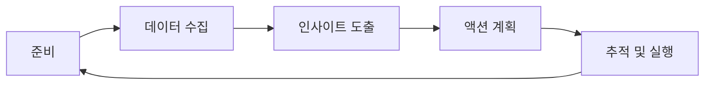

# 🔄 스프린트 회고 템플릿

> Korea Public Data 프로젝트의 지속적인 개선을 위한 체계적인 회고 프로세스

## 📋 목차
- [회고 개요](#회고-개요)
- [회고 프로세스](#회고-프로세스)
- [스프린트 회고 템플릿](#스프린트-회고-템플릿)
- [개선사항 추적](#개선사항-추적)
- [회고 메트릭](#회고-메트릭)
- [팀 성장 지표](#팀-성장-지표)

## 🎯 회고 개요

### 회고의 목적
1. **지속적 개선**: 프로세스, 도구, 협업 방식의 점진적 향상
2. **팀 성장**: 개인 및 팀 역량 강화
3. **문제 해결**: 반복되는 이슈의 근본 원인 파악 및 해결
4. **성과 인정**: 팀과 개인의 성취를 인정하고 동기부여

### 회고 원칙
- **안전한 환경**: 솔직하고 건설적인 피드백이 가능한 분위기
- **액션 중심**: 구체적이고 실행 가능한 개선 방안 도출
- **데이터 기반**: 객관적인 메트릭과 사실에 근거한 논의
- **전체 참여**: 모든 팀원의 의견이 존중되고 반영

## 🔄 회고 프로세스

### 회고 주기 및 참석자
```yaml
retrospective_schedule:
  sprint_retrospective:
    frequency: "2주마다 (스프린트 종료 후)"
    duration: "90분"
    participants: ["Scrum Master", "Product Owner", "Development Team"]
    
  quarterly_retrospective:
    frequency: "분기별"
    duration: "3시간"
    participants: ["전체 팀", "Stakeholders"]
    
  project_retrospective:
    frequency: "프로젝트 완료 후"
    duration: "2시간"
    participants: ["Core Team", "Key Stakeholders"]
```

### 회고 진행 단계


## 📊 스프린트 회고 템플릿

### 스프린트 기본 정보
```markdown
# Sprint #XX Retrospective

**날짜**: 2025-08-14
**스프린트 기간**: 2025-07-29 ~ 2025-08-11 (2주)
**참석자**: [PM, Frontend Lead, Backend Lead, DevOps, QA Lead]
**진행자**: [Scrum Master]

## 스프린트 목표 달성도
- [ ] 목표 1: 사용자 알림 기능 구현
- [x] 목표 2: 성능 최적화 (목표: 응답시간 20% 개선)
- [x] 목표 3: 테스트 커버리지 80% 달성
- [ ] 목표 4: 모바일 반응형 개선

**전체 달성률**: 50% (2/4)
```

### 스프린트 메트릭 요약
| 메트릭 | 목표 | 실제 | 상태 |
|--------|------|------|------|
| Velocity | 40 SP | 35 SP | 🟡 |
| Commitment | 100% | 87% | 🟡 |
| Bug Count | < 5 | 3 | ✅ |
| Test Coverage | 80% | 85% | ✅ |
| Deploy Success Rate | 100% | 90% | 🟡 |
| Code Review Time | < 24h | 18h | ✅ |

### What Went Well? 👍
*팀이 잘했던 점들을 구체적으로 기록*

1. **성능 최적화 성공**
   - API 응답 시간 25% 개선 (목표 20% 초과 달성)
   - 프론트엔드 번들 사이즈 15% 감소
   - **기여 요인**: 체계적인 성능 프로파일링, 팀 전체의 성능 의식

2. **테스트 자동화 강화**
   - 테스트 커버리지 85% 달성 (목표 80% 초과)
   - E2E 테스트 안정성 향상
   - **기여 요인**: TDD 도입, 페어 프로그래밍

3. **팀 협업 개선**
   - 일일 스탠드업 효율성 증대
   - 코드 리뷰 품질 및 속도 개선
   - **기여 요인**: 새로운 코드 리뷰 템플릿, 명확한 기준

### What Didn't Go Well? 👎
*개선이 필요한 영역들*

1. **사용자 알림 기능 미완성**
   - **원인**: 외부 API 연동 복잡도 과소평가
   - **영향**: 스프린트 목표 미달성, 다음 스프린트로 이월
   - **학습**: 외부 의존성이 있는 작업의 리스크 평가 강화 필요

2. **배포 실패 발생**
   - **원인**: 환경 변수 설정 오류
   - **영향**: 배포 성공률 90%로 하락
   - **학습**: 배포 전 체크리스트 강화 필요

3. **기술 부채 누적**
   - **원인**: 기능 개발 우선으로 리팩토링 시간 부족
   - **영향**: 코드 복잡도 증가, 개발 속도 저하 우려
   - **학습**: 스프린트마다 기술 부채 해결 시간 할당 필요

### What Can We Improve? 🚀
*구체적인 개선 방안*

1. **추정 정확도 향상**
   - **문제**: Story Point 추정과 실제 소요 시간 차이
   - **해결책**: Planning Poker 도입, 과거 데이터 기반 추정
   - **담당자**: Scrum Master
   - **기한**: 다음 스프린트 플래닝부터

2. **외부 의존성 관리**
   - **문제**: 외부 API 연동 작업의 불확실성
   - **해결책**: Spike 스토리 도입, Mock 서비스 우선 개발
   - **담당자**: Tech Lead
   - **기한**: 2025-08-21

3. **배포 안정성 강화**
   - **문제**: 환경 설정 관련 배포 실패
   - **해결책**: Infrastructure as Code 도입, 자동화된 검증
   - **담당자**: DevOps Team
   - **기한**: 2025-08-28

### Team Mood 😊😐😞
팀원들의 스프린트에 대한 만족도

| 팀원 | 만족도 | 코멘트 |
|------|--------|--------|
| Frontend Lead | 😊 | 성능 개선 성과에 만족, 새로운 도구 학습 즐거움 |
| Backend Lead | 😐 | 기술 부채 처리 시간 부족으로 아쉬움 |
| DevOps | 😞 | 배포 이슈로 인한 스트레스 |
| QA Lead | 😊 | 테스트 자동화 진전에 만족 |

### Action Items 📝

| 액션 | 담당자 | 우선순위 | 기한 | 상태 |
|------|--------|----------|------|------|
| Planning Poker 도입 | Scrum Master | High | 2025-08-21 | Todo |
| 외부 API Mock 서버 구축 | Backend Team | High | 2025-08-25 | Todo |
| 배포 체크리스트 업데이트 | DevOps | Medium | 2025-08-28 | Todo |
| 기술 부채 백로그 정리 | Tech Lead | Medium | 2025-08-30 | Todo |
| 코드 복잡도 메트릭 설정 | All | Low | 2025-09-05 | Todo |

## 📈 개선사항 추적

### 이전 회고 액션 아이템 진행 상황
| 액션 | 상태 | 진행률 | 결과 |
|------|------|--------|------|
| 코드 리뷰 템플릿 도입 | ✅ Done | 100% | 리뷰 시간 30% 단축 |
| 자동화된 테스트 커버리지 리포트 | ✅ Done | 100% | 매일 커버리지 모니터링 |
| API 응답 시간 모니터링 | 🟡 In Progress | 80% | 대시보드 구축 완료, 알림 설정 중 |
| 팀 위키 문서화 | ❌ Blocked | 30% | 리소스 부족으로 지연 |

### 장기 개선 트렌드
```markdown
## 분기별 개선 지표

### Q2 2025
- Velocity 안정성: ±15% → ±10%
- 배포 성공률: 85% → 95%
- 버그 탈출률: 3% → 1.5%

### Q3 2025 목표
- Velocity 안정성: ±8%
- 배포 성공률: 98%
- 버그 탈출률: 1%
```

## 📊 회고 메트릭

### 팀 성과 지표
```yaml
team_metrics:
  velocity:
    current_sprint: 35
    last_3_sprints_avg: 38
    trend: "하락세 (-8%)"
    
  quality:
    bug_count: 3
    test_coverage: 85%
    code_review_time: 18h
    
  delivery:
    deployment_frequency: "주 2회"
    lead_time: "5일"
    mttr: "2시간"
    
  team_health:
    satisfaction_score: 3.5/5
    psychological_safety: 4.2/5
    learning_culture: 4.0/5
```

### 개선사항 효과 측정
| 개선사항 | Before | After | 개선률 |
|----------|--------|-------|--------|
| 코드 리뷰 시간 | 24시간 | 18시간 | 25% ⬇ |
| 테스트 커버리지 | 70% | 85% | 21% ⬆ |
| 배포 실패율 | 15% | 10% | 33% ⬇ |
| API 응답 시간 | 400ms | 300ms | 25% ⬇ |

## 🎯 팀 성장 지표

### 개인 성장 추적
```markdown
## 팀원별 성장 영역

### Frontend Developer A
- **강점**: React 성능 최적화, 컴포넌트 설계
- **성장 영역**: TypeScript 고급 기능, 테스팅
- **학습 목표**: Jest/RTL 마스터리 (Q3)

### Backend Developer B
- **강점**: API 설계, 데이터베이스 최적화
- **성장 영역**: 마이크로서비스 패턴, 모니터링
- **학습 목표**: 분산 시스템 아키텍처 (Q4)

### DevOps Engineer C
- **강점**: CI/CD, 인프라 자동화
- **성장 영역**: 보안, 성능 튜닝
- **학습 목표**: 쿠버네티스 보안 (Q3)
```

### 지식 공유 현황
| 주제 | 발표자 | 날짜 | 참석자 | 평가 |
|------|--------|------|--------|------|
| React 성능 최적화 | Frontend A | 2025-08-10 | 8명 | 4.5/5 |
| MongoDB 인덱싱 전략 | Backend B | 2025-08-05 | 6명 | 4.2/5 |
| Docker 멀티스테이지 빌드 | DevOps C | 2025-07-30 | 7명 | 4.0/5 |

## 🔄 다음 스프린트 계획

### 우선순위 개선사항
1. **사용자 알림 기능 완성** (이월 작업)
2. **Planning Poker 도입으로 추정 정확도 향상**
3. **배포 프로세스 안정화**

### 실험할 새로운 접근법
- **Pair Programming**: 복잡한 기능 개발 시 적용
- **Spike Stories**: 불확실성이 높은 작업에 도입
- **Bug Bash**: 스프린트 말 전체 팀 버그 헌팅

### 다음 회고 포커스
- Planning Poker 효과성 측정
- 배포 안정성 개선 결과 평가
- 팀 만족도 변화 모니터링

## 📚 회고 도구 및 템플릿

### 온라인 도구
- **Miro**: 시각적 회고 보드
- **Retrium**: 구조화된 온라인 회고
- **Slack**: 비동기 피드백 수집

### 다양한 회고 포맷
1. **Mad/Sad/Glad**
2. **Start/Stop/Continue** 
3. **4Ls (Liked/Learned/Lacked/Longed for)**
4. **Sailboat (Wind/Anchors/Rocks/Island)**

## 🔄 업데이트 이력

| 버전 | 날짜 | 변경사항 | 작성자 |
|------|------|----------|--------|
| 1.0.0 | 2025-08-14 | 초기 스프린트 회고 템플릿 작성 | PM |

---

*효과적인 회고는 팀의 지속적인 성장과 개선의 핵심입니다. 모든 팀원이 적극적으로 참여하여 더 나은 팀을 만들어 나가시기 바랍니다.*